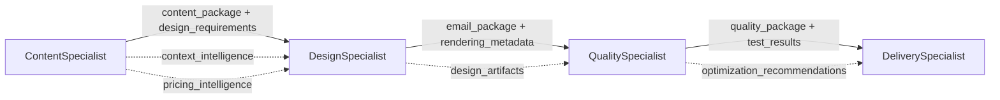

# 🤖 Email-Makers Agent Debug Manual

## 🔄 СТРУКТУРА ПЕРЕДАЧИ ДАННЫХ МЕЖДУ АГЕНТАМИ

Email-Makers использует стандартизированную многоагентную архитектуру с четкой передачей данных между специализированными агентами. Каждый агент принимает структурированные входные данные, обрабатывает их с помощью специализированных инструментов и передает валидированные выходные данные следующему агенту в конвейере.

### 🏗️ Архитектура передачи данных



### 📊 Детальная структура handoff_data

#### 1. ContentSpecialist → DesignSpecialist

**Основные данные:**
```typescript
interface ContentToDesignHandoff {
  content_package: {
    content: {
      subject: string;           // "Авиабилеты Москва-Сочи от 8,500₽!"
      preheader: string;         // "Успейте забронировать по специальной цене"
      body: string;              // Полный текст письма
      cta: string;               // "Найти билеты"
      language: 'ru' | 'en';     // Язык контента
      tone: 'professional' | 'friendly' | 'urgent' | 'casual' | 'luxury' | 'family';
    };
  };
  design_requirements: {
    tone: string;                // "friendly"
    style: string;               // "travel_promotional"
    color_scheme: string;        // "warm_gradient"
    imagery_focus: string;       // "destination_focused"
    layout_priority: string;     // "price_prominence"
    template_type?: string;      // "promotional"
    visual_hierarchy?: string;   // "price_first"
    responsive_breakpoints?: string[];
    accessibility_requirements?: {
      contrast_ratio: string;    // "WCAG_AA"
      font_size_min: string;     // "14px"
      alt_text_required: boolean;
    };
  };
  brand_guidelines: {
    brand_voice: string;         // "helpful_expert"
    visual_style: string;        // "modern_clean"
    color_palette: string[];     // ["#4BFF7E", "#1DA857", "#2C3959"]
    typography: string;          // "system_sans"
    brand_name?: string;         // "Kupibilet"
    logo_requirements?: {
      position: string;          // "header_left"
      size: string;              // "medium"
      variant: string;           // "color"
    };
    tone_guidelines?: {
      primary_tone: string;      // "friendly"
      voice_attributes: string[]; // ["helpful", "trustworthy", "efficient"]
      language: 'ru' | 'en';
    };
    visual_guidelines?: {
      imagery_style: string;     // "photography_illustration_mix"
      icon_style: string;        // "outlined"
      button_style: string;      // "rounded_filled"
    };
  };
}
```

**Контекстная информация:**
```typescript
interface ContextIntelligence {
  context_intelligence: {
    seasonal_context?: {
      current_season: 'spring' | 'summer' | 'autumn' | 'winter';
      holidays: string[];        // ["Новый год", "8 марта"]
      seasonal_trends: string[]; // ["winter_travel", "ski_season"]
    };
    cultural_context?: {
      regional_preferences: Record<string, any>;
      cultural_events: string[];
      demographic_insights: Record<string, any>;
    };
    marketing_context?: {
      travel_trends: string[];   // ["budget_travel", "family_trips"]
      pricing_trends: Record<string, any>;
      urgency_factors: string[]; // ["limited_time", "price_drop"]
    };
  };
  pricing_intelligence: {
    prices: Array<{
      price: number;             // 8500
      currency: string;          // "RUB"
      date?: string;             // "2025-02-15"
      airline?: string;          // "Aeroflot"
    }>;
    statistics: {
      min_price?: number;        // 8500
      max_price?: number;        // 15000
      avg_price?: number;        // 11250
      median_price?: number;     // 10500
    };
    pricing_insights: {
      price_trend: 'increasing' | 'decreasing' | 'stable';
      urgency_level: 'low' | 'medium' | 'high';
      best_booking_time?: string; // "next_2_weeks"
    };
    marketing_copy: {
      urgency_message?: string;  // "Цены растут! Бронируйте сейчас"
      price_highlight?: string;  // "от 8,500₽"
      value_proposition?: string; // "Экономия до 40%"
    };
  };
}
```

#### 2. DesignSpecialist → QualitySpecialist

```typescript
interface DesignToQualityHandoff {
  email_package: {
    html: string;                // Полный HTML код письма
    mjml: string;                // Исходный MJML код
    assets: string[];            // ["rabbit_happy.png", "logo.svg"]
    css_inline: boolean;         // true - CSS инлайнен в HTML
    file_size: number;           // Размер в байтах
  };
  rendering_metadata: {
    template_type: 'promotional' | 'transactional' | 'newsletter' | 'premium';
    email_client_optimization: 'gmail' | 'outlook' | 'apple_mail' | 'universal';
    responsive_design: boolean;   // true - адаптивный дизайн
    dark_mode_support: boolean;   // true - поддержка темной темы
    accessibility_score: number; // 0-100
    performance_score: number;   // 0-100
  };
  design_artifacts: {
    assets_used: string[];       // Пути к использованным ассетам
    color_analysis: {
      primary_colors: string[];  // ["#4BFF7E", "#1DA857"]
      contrast_ratios: Record<string, number>;
      accessibility_compliance: boolean;
    };
    typography_analysis: {
      fonts_used: string[];      // ["Arial", "Helvetica"]
      readability_score: number; // 0-100
      font_size_compliance: boolean;
    };
    layout_analysis: {
      structure_type: string;    // "table_based"
      responsive_breakpoints: string[];
      mobile_optimization: boolean;
    };
    performance_metrics: {
      render_time: number;       // Время рендеринга в мс
      compilation_time: number;  // Время компиляции MJML
      optimization_applied: string[]; // ["css_inline", "image_compress"]
    };
  };
}
```

#### 3. QualitySpecialist → DeliverySpecialist

```typescript
interface QualityToDeliveryHandoff {
  quality_package: {
    validated_html: string;      // HTML прошедший валидацию
    quality_score: number;       // 0-100 общий балл качества
    validation_status: 'passed' | 'failed' | 'warning';
    compatibility_report: {
      gmail: { score: number; issues: string[] };
      outlook: { score: number; issues: string[] };
      apple_mail: { score: number; issues: string[] };
      yahoo_mail: { score: number; issues: string[] };
    };
    accessibility_report: {
      wcag_aa_compliance: boolean;
      contrast_ratios: Record<string, number>;
      alt_text_coverage: number; // Процент изображений с alt
      keyboard_navigation: boolean;
    };
    performance_report: {
      file_size: number;         // Финальный размер файла
      load_time_estimate: number; // Прогноз времени загрузки
      optimization_score: number; // 0-100
      recommendations: string[];
    };
  };
  test_results: {
    html_validation: {
      valid: boolean;
      errors: string[];
      warnings: string[];
    };
    css_validation: {
      valid: boolean;
      errors: string[];
      warnings: string[];
    };
    email_client_tests: Array<{
      client: string;
      version: string;
      status: 'pass' | 'fail' | 'warning';
      screenshot_url?: string;
      issues: string[];
    }>;
    spam_analysis: {
      spam_score: number;        // 0-10 (меньше = лучше)
      spam_triggers: string[];
      deliverability_score: number; // 0-100
    };
  };
  optimization_recommendations: {
    priority_fixes: string[];    // Критические исправления
    suggested_improvements: string[]; // Рекомендуемые улучшения
    performance_optimizations: string[]; // Оптимизации производительности
    accessibility_enhancements: string[]; // Улучшения доступности
    cross_client_fixes: string[]; // Исправления совместимости
  };
}
```

### 🔍 Валидация данных на каждом этапе

#### Обязательные поля для каждого handoff:
- **Все переходы**: `success: boolean`, `execution_time: number`, `confidence_score: number`
- **ContentSpecialist**: `content_package.content.*` - все поля обязательны
- **DesignSpecialist**: `email_package.html` и `email_package.mjml` - обязательны
- **QualitySpecialist**: `quality_package.validated_html` и `quality_score ≥ 70` - обязательны

#### Проверки целостности:
1. **Размер данных**: Общий размер handoff_data не должен превышать 10MB
2. **Валидность HTML**: HTML код должен проходить W3C валидацию
3. **Безопасность**: Все URL и пути должны быть проверены на безопасность
4. **Производительность**: Время выполнения каждого агента ≤ 30 секунд

### 🚫 Критические ошибки handoff

1. **HANDOFF_VALIDATION_FAILED**: Данные не прошли Zod валидацию
2. **CONTENT_INCOMPLETE**: Отсутствуют обязательные поля контента
3. **HTML_INVALID**: HTML код содержит критические ошибки
4. **QUALITY_THRESHOLD_NOT_MET**: Балл качества < 70
5. **HANDOFF_TIMEOUT**: Передача данных превысила таймаут

### ⚡ Оптимизация передачи данных

- **Сжатие**: Большие JSON данные сжимаются gzip
- **Кэширование**: Повторяющиеся ассеты кэшируются
- **Валидация**: Предварительная валидация для быстрого обнаружения ошибок
- **Логирование**: Полная трассировка всех handoff операций

---

## Обзор системы агентов

Email-Makers использует многоагентную архитектуру для создания email-кампаний. Каждый агент специализируется на определенной области и может работать как самостоятельно, так и в составе конвейера.

## 🎯 Архитектура агентов

### Основные агенты:

1. **ContentSpecialist** - Генерация контента и анализ контекста
2. **DesignSpecialist** - Дизайн и рендеринг email-шаблонов  
3. **QualitySpecialist** - Контроль качества и валидация
4. **DeliverySpecialist** - Финализация и доставка

### Структура файлов:

```
src/agent/
├── specialists/                    # Основные агенты
│   ├── content-specialist-agent.ts # ContentSpecialist
│   ├── design-specialist-agent.ts  # DesignSpecialist
│   ├── quality-specialist-agent.ts # QualitySpecialist (stub)
│   └── delivery-specialist-agent.ts # DeliverySpecialist (stub)
├── tools/                          # Инструменты агентов
│   ├── consolidated/               # Консолидированные инструменты
│   ├── simple/                     # Простые инструменты
│   ├── figma/                      # Figma интеграция
│   └── validators/                 # Валидаторы
├── core/                           # Базовая функциональность
└── types/                          # Типы и интерфейсы
```

---

## 🔧 API Эндпоинты для отладки

### 1. ContentSpecialist API

**Эндпоинт:** `POST /api/agent/content-specialist`

**Назначение:** Генерация контента, анализ контекста, получение ценовой информации

**Параметры:**
```json
{
  "task_type": "generate_content" | "analyze_context" | "get_pricing" | "manage_campaign",
  "topic": "строка с темой кампании",
  "content_type": "complete_campaign" | "email" | "subject_line" | "preheader" | "body_text",
  "tone": "friendly" | "professional" | "urgent" | "casual" | "luxury" | "family",
  "language": "ru" | "en",
  "target_audience": "general" | "business" | "family" | "luxury",
  "origin": "город отправления (для pricing)",
  "destination": "город назначения (для pricing)"
}
```

**Пример запроса:**
```bash
curl -X POST http://localhost:3000/api/agent/content-specialist \
  -H "Content-Type: application/json" \
  -d '{
    "task_type": "generate_content",
    "topic": "авиабилеты Москва-Сочи зима 2025",
    "origin": "Москва",
    "destination": "Сочи",
    "tone": "friendly",
    "language": "ru"
  }'
```

**Ответ:**
```json
{
  "status": "success",
  "data": {
    "agent": "content-specialist",
    "task_type": "generate_content",
    "success": true,
    "results": {
      "content_data": {
        "complete_content": {
          "subject": "Авиабилеты Москва-Сочи от 0 RUB!",
          "preheader": "Не упустите шанс! Летите в Сочи этой зимой.",
          "body": "Полный текст письма...",
          "cta": "Найти билеты"
        }
      }
    },
    "handoff_data": { /* данные для передачи следующему агенту */ },
    "analytics": {
      "execution_time": 8680,
      "confidence_score": 75,
      "agent_efficiency": 88
    }
  }
}
```

### 2. DesignSpecialist API

**Эндпоинт:** `POST /api/agent/design-specialist`

**Назначение:** Рендеринг email-шаблонов, подбор ассетов, применение дизайна

**Параметры:**
```json
{
  "task_type": "render_email" | "select_assets" | "apply_design",
  "content_package": {
    "content": {
      "subject": "тема письма",
      "preheader": "превью",
      "body": "содержание",
      "cta": "текст кнопки"
    }
  },
  "asset_requirements": {
    "style": "travel" | "business" | "casual",
    "emotion": "happy" | "urgent" | "calm",
    "count": 5
  },
  "rendering_requirements": {
    "template_type": "promotional" | "transactional" | "newsletter",
    "mobile_optimized": true,
    "dark_mode_support": true
  }
}
```

**Пример запроса:**
```bash
curl -X POST http://localhost:3000/api/agent/design-specialist \
  -H "Content-Type: application/json" \
  -d '{
    "task_type": "render_email",
    "content_package": {
      "content": {
        "subject": "Специальное предложение",
        "body": "Тестовое содержание письма",
        "cta": "Перейти"
      }
    }
  }'
```

### 3. QualitySpecialist API

**Эндпоинт:** `POST /api/agent/quality-specialist`

**Назначение:** Контроль качества, валидация HTML, проверка совместимости

**Параметры:**
```json
{
  "task_type": "comprehensive_audit" | "html_validation" | "compatibility_check",
  "email_package": {
    "html": "HTML код письма",
    "mjml": "MJML исходник",
    "assets": ["список ассетов"]
  },
  "quality_requirements": {
    "min_score": 85,
    "client_compatibility": ["gmail", "outlook", "apple_mail"],
    "accessibility_check": true
  }
}
```

### 4. DeliverySpecialist API

**Эндпоинт:** `POST /api/agent/delivery-specialist`

**Назначение:** Финализация, создание файлов, подготовка к доставке

**Параметры:**
```json
{
  "task_type": "finalize_delivery" | "create_package" | "generate_preview",
  "quality_package": {
    "validated_html": "проверенный HTML",
    "quality_score": 88,
    "compatibility_report": {}
  },
  "delivery_requirements": {
    "format": "html" | "mjml" | "zip",
    "include_assets": true,
    "create_preview": true
  }
}
```

---

## 🎨 Веб-интерфейс для отладки

### Доступ к интерфейсу

Перейдите по адресу: **http://localhost:3000/agent-debug**

### Возможности интерфейса:

1. **Тестирование каждого агента отдельно**
2. **Просмотр результатов в реальном времени**
3. **Анализ времени выполнения**
4. **Просмотр ошибок и логов**
5. **Настройка параметров для каждого агента**

### Интерфейс включает:

- **Табы для каждого агента** - переключение между специалистами
- **Формы ввода параметров** - настройка запросов
- **Кнопки тестирования** - запуск агентов
- **Область результатов** - отображение ответов
- **Индикаторы статуса** - loading, success, error
- **Метрики производительности** - время выполнения, эффективность

---

## 🔍 Инструменты агентов

### ContentSpecialist использует:

1. **context_provider** - анализ контекста и трендов
2. **pricing_intelligence** - получение ценовой информации
3. **content_create** - генерация текстового контента
4. **campaign_manager** - управление кампаниями (отключен)

### DesignSpecialist использует:

1. **figma_search** - поиск ассетов в Figma
2. **email_renderer** - рендеринг MJML в HTML
3. **asset_combiner** - объединение ассетов
4. **template_optimizer** - оптимизация шаблонов

### Консолидированные инструменты:

1. **email-renderer** - универсальный рендерер
2. **figma-processor** - обработка Figma данных
3. **quality-validator** - валидация качества
4. **file-manager** - управление файлами

---

## 📊 Мониторинг и отладка

### Логирование

Все агенты ведут подробные логи:

```bash
# Просмотр логов сервера
npm run dev

# Логи в консоли браузера (F12)
console.log('🧠 ContentSpecialist:', result)
console.log('🎨 DesignSpecialist:', result)
```

### Метрики производительности

Каждый агент возвращает аналитику:

```json
{
  "analytics": {
    "execution_time": 8680,        // время выполнения в мс
    "operations_performed": 1,     // количество операций
    "confidence_score": 75,        // уверенность в результате
    "agent_efficiency": 88         // эффективность агента
  }
}
```

### Диагностика проблем

**Проблема: Агент возвращает 0 инструментов**
- Проверьте, что агент использует прямые вызовы функций, а не `run()`
- Убедитесь, что инструменты правильно импортированы

**Проблема: Пустой контент в письмах**
- Проверьте передачу данных между агентами в `handoff_data`
- Убедитесь, что `contentData.body` заполнен

**Проблема: Ошибки TypeScript**
- Запустите `npx tsc --noEmit` для проверки типов
- Исправьте типы в соответствии с интерфейсами

---

## 🚀 Workflow агентов

### Полный конвейер:

```
1. ContentSpecialist
   ↓ handoff_data
2. DesignSpecialist  
   ↓ handoff_data
3. QualitySpecialist
   ↓ handoff_data
4. DeliverySpecialist
   ↓ final_output
```

### Передача данных между агентами:

```typescript
// ContentSpecialist → DesignSpecialist
{
  content_package: {
    content: {
      subject: "тема",
      body: "содержание",
      cta: "кнопка"
    }
  },
  design_requirements: { /* требования к дизайну */ },
  brand_guidelines: { /* бренд-гайдлайны */ }
}

// DesignSpecialist → QualitySpecialist  
{
  email_package: {
    html: "готовый HTML",
    mjml: "исходный MJML",
    assets: ["список файлов"]
  },
  rendering_metadata: { /* метаданные рендеринга */ }
}

// QualitySpecialist → DeliverySpecialist
{
  quality_package: {
    validated_html: "проверенный HTML",
    quality_score: 88,
    compatibility_report: { /* отчет совместимости */ }
  }
}
```

---

## 🛠️ Разработка и расширение

### Добавление нового агента:

1. Создайте класс агента в `src/agent/specialists/`
2. Реализуйте интерфейс `BaseAgentInput/Output`
3. Добавьте API эндпоинт в `src/app/api/agent/`
4. Обновите интерфейс отладки

### Добавление нового инструмента:

1. Создайте функцию в `src/agent/tools/`
2. Определите Zod схему параметров
3. Добавьте в список инструментов агента
4. Обновите типы в `src/agent/types/`

### Тестирование:

```bash
# Запуск всех тестов
npm test

# Тестирование конкретного агента
npm test -- --grep "ContentSpecialist"

# Проверка типов
npx tsc --noEmit
```

---

## 📝 Примеры использования

### Тестирование ContentSpecialist:

```bash
# Генерация контента
curl -X POST http://localhost:3000/api/agent/content-specialist \
  -H "Content-Type: application/json" \
  -d '{
    "task_type": "generate_content",
    "topic": "летние скидки на авиабилеты",
    "tone": "friendly",
    "language": "ru"
  }'

# Анализ контекста
curl -X POST http://localhost:3000/api/agent/content-specialist \
  -H "Content-Type: application/json" \
  -d '{
    "task_type": "analyze_context",
    "topic": "новогодние путешествия"
  }'
```

### Тестирование DesignSpecialist:

```bash
# Рендеринг email
curl -X POST http://localhost:3000/api/agent/design-specialist \
  -H "Content-Type: application/json" \
  -d '{
    "task_type": "render_email",
    "content_package": {
      "content": {
        "subject": "Новогодние скидки до 50%!",
        "body": "Успейте забронировать билеты по специальной цене",
        "cta": "Выбрать билеты"
      }
    }
  }'
```

---

## 🔧 Конфигурация

### Переменные окружения:

```env
# API ключи
OPENAI_API_KEY=your_openai_key
FIGMA_ACCESS_TOKEN=your_figma_token

# Настройки агентов
AGENT_TIMEOUT=30000
AGENT_RETRY_COUNT=3
AGENT_LOG_LEVEL=debug

# Настройки рендеринга
MJML_VALIDATION_LEVEL=strict
EMAIL_CLIENT_COMPATIBILITY=all
```

### Настройки агентов в коде:

```typescript
// Настройки ContentSpecialist
const contentConfig = {
  defaultTone: 'friendly',
  defaultLanguage: 'ru',
  maxContentLength: 1000,
  confidenceThreshold: 70
};

// Настройки DesignSpecialist  
const designConfig = {
  defaultTemplate: 'promotional',
  mobileFirst: true,
  darkModeSupport: true,
  maxImageSize: '600px'
};
```

---

## 📚 Дополнительные ресурсы

- **Архитектура проекта:** `/docs/ARCHITECTURE.md`
- **API документация:** `/docs/API.md`
- **Figma интеграция:** `/docs/FIGMA_INTEGRATION.md`
- **Email стандарты:** `/docs/EMAIL_STANDARDS.md`

---

## 🐛 Известные проблемы и решения

### Проблема: Агенты не используют инструменты (0 tools used)

**Причина:** Использование `run()` вместо прямых вызовов функций

**Решение:**
```typescript
// ❌ Неправильно
const result = await run(this.agent, "Generate content about travel");

// ✅ Правильно  
const result = await contentCreate({
  topic: "travel",
  content_type: "email",
  tone: "friendly"
});
```

### Проблема: Пустой body в email

**Причина:** Неправильная передача данных между агентами

**Решение:** Проверить структуру `handoff_data`:
```typescript
const handoffData = {
  content_package: {
    content: {
      subject: contentData.subject,
      body: contentData.body, // Убедитесь, что это поле заполнено
      cta: contentData.cta
    }
  }
};
```

### Проблема: TypeScript ошибки

**Решение:** Регулярно проверяйте типы:
```bash
npx tsc --noEmit
```

---

## 📞 Поддержка

Для получения помощи:

1. Проверьте логи в консоли браузера и терминале
2. Используйте веб-интерфейс отладки: http://localhost:3000/agent-debug
3. Тестируйте API эндпоинты через curl
4. Проверьте TypeScript ошибки: `npx tsc --noEmit`

**Удачной отладки! 🚀** 