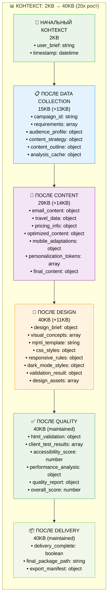

# 📋 ДЕТАЛЬНАЯ ДИАГРАММА ПОТОКА ДАННЫХ ДЛЯ ДЖУНИОР РАЗРАБОТЧИКА
## Email-Makers: Полный Поток Файлов, Функций и Данных

*Создано: 15 января 2025*
*Максимально подробная схема для понимания системы*

---

## 🎯 ОБЗОР

Эта диаграмма показывает **ТОЧНО**:
- Какая функция создает какой файл
- Что записывается в контекст и кем извлекается
- Какие данные передаются между функциями
- Размеры файлов и время выполнения
- Последовательность операций чтения/записи

---

## 📊 1. ДЕТАЛЬНЫЙ ПОТОК СОЗДАНИЯ И ЧТЕНИЯ ФАЙЛОВ

### Полная схема: Функция → Файл → Данные → Размер


---

## 📁 2. ПОЛНАЯ СТРУКТУРА ФАЙЛОВ И ИХ СОЗДАТЕЛИ

### Таблица: Файл → Функция → Размер → Время

| **Файл** | **Создается функцией** | **Размер** | **Время** | **Содержание** |
|----------|----------------------|------------|-----------|----------------|
| `campaign-metadata.json` | `create_campaign_folder()` | ~1KB | 0-2s | Метаданные кампании, статус, структура |
| `README.md` | `create_campaign_folder()` | ~1KB | 0-2s | Описание кампании и структуры |
| `data/requirements-analysis.json` | `extract_requirements()` | ~2-3KB | 5-8s | Извлеченные требования и ограничения |
| `data/emotional-profile.json` | `analyze_target_audience()` | ~500B | 8-12s | Эмоциональный профиль аудитории |
| `data/destination-analysis.json` | `analyze_target_audience()` | ~932B | 8-12s | Анализ направления путешествия |
| `data/market-intelligence.json` | `determine_content_strategy()` | ~654B | 12-15s | Рыночная аналитика |
| `data/trend-analysis.json` | `determine_content_strategy()` | ~797B | 12-15s | Анализ трендов |
| `content/outline-structure.json` | `create_content_outline()` | ~2-3KB | 15-18s | Структура контента |
| `data/consolidated-insights.json` | `cache_analysis_results()` | ~703B | 18-19s | Консолидированные инсайты |
| `handoffs/data-to-content.json` | `prepare_handoff()` | ~3-5KB | 20s | Передача данных к контенту |
| `content/email-content.json` | `generate_email_content()` | ~4.8KB | 22-35s | Сгенерированный контент email |
| `content/email-content.md` | `generate_email_content()` | ~2.8KB | 22-35s | Markdown версия контента |
| `content/pricing-analysis.json` | `integrate_travel_data()` | ~2.9KB | 35-40s | Анализ цен от Kupibilet API |
| `content/date-analysis.json` | `integrate_travel_data()` | ~1.8KB | 35-40s | Анализ дат поездки |
| `handoffs/content-to-design.json` | `prepare_design_handoff()` | ~5-7KB | 63-65s | Передача контента к дизайну |
| `content/design-brief-from-context.json` | `create_design_brief()` | ~3.1KB | 67-69s | Дизайн-бриф из контекста |
| `templates/email-template.mjml` | `generate_mjml_template()` | ~8-12KB | 75-78s | MJML шаблон email |
| `assets/email-template.html` | `save_design_assets()` | ~12KB | 86-87s | HTML версия шаблона |
| `assets/styles.css` | `save_design_assets()` | ~3KB | 86-87s | CSS стили |
| `design-decisions.json` | `save_design_assets()` | ~709B | 86-87s | Дизайнерские решения |
| `handoffs/design-to-quality.json` | `prepare_quality_handoff()` | ~1KB | 88-90s | Передача к QA |
| `handoffs/design-specialist-to-qa-specialist.json` | `prepare_quality_handoff()` | ~1.4KB | 88-90s | Детальная передача к QA |
| `docs/quality-report.json` | `generate_quality_report()` | ~3-5KB | 109-110s | Отчет о качестве |
| `docs/test-results.json` | `generate_quality_report()` | ~3-5KB | 109-110s | Результаты тестирования |
| `handoffs/quality-to-delivery.json` | `prepare_delivery_handoff()` | ~2-3KB | 111-112s | Передача к доставке |
| `exports/final-email-template.html` | `package_final_template()` | ~15KB | 113-115s | Финальный HTML шаблон |
| `exports/template-package.zip` | `package_final_template()` | ~25KB | 113-115s | Пакет шаблона |
| `exports/campaign-complete.zip` | `create_export_package()` | ~50KB | 115-117s | Полный пакет кампании |
| `exports/delivery-manifest.json` | `create_export_package()` | ~2KB | 115-117s | Манифест доставки |

---

## 🧠 3. ДЕТАЛЬНАЯ ЭВОЛЮЦИЯ КОНТЕКСТА

### Что добавляется в контекст на каждом этапе



---

## 🔄 4. ДЕТАЛЬНАЯ СХЕМА ЧТЕНИЯ/ЗАПИСИ ДАННЫХ

### Операции файловой системы по времени

```mermaid
gantt
    title Операции Чтения/Записи по Времени
    dateFormat X
    axisFormat %Ls
    
    section Data Collection (0-20s)
    Создание папки кампании                    :milestone, 0, 2
    Запись campaign-metadata.json              :2, 3
    Запись README.md                           :2, 3
    Запись requirements-analysis.json          :5, 8
    Запись emotional-profile.json              :8, 12
    Запись destination-analysis.json           :8, 12
    Запись market-intelligence.json            :12, 15
    Запись trend-analysis.json                 :12, 15
    Запись outline-structure.json              :15, 18
    Запись consolidated-insights.json          :18, 19
    Запись data-to-content.json                :20, 20
    
    section Content (20-65s)
    Чтение handoff файлов                      :20, 22
    OpenAI API: генерация контента             :22, 35
    Запись email-content.json                  :22, 35
    Запись email-content.md                    :22, 35
    Kupibilet API: данные о поездках           :35, 40
    Запись pricing-analysis.json               :35, 40
    Запись date-analysis.json                  :35, 40
    OpenAI API: оптимизация                    :40, 50
    OpenAI API: персонализация                 :52, 60
    Запись content-to-design.json              :63, 65
    
    section Design (65-90s)
    Чтение content handoff                     :65, 67
    Запись design-brief-from-context.json      :67, 69
    Запись email-template.mjml                 :75, 78
    Internal AI: валидация дизайна             :84, 85
    Запись email-template.html                 :86, 87
    Запись styles.css                          :86, 87
    Запись design-decisions.json               :86, 87
    Запись design-to-quality.json              :88, 90
    
    section Quality (90-112s)
    Чтение design handoff                      :90, 92
    Чтение HTML/MJML файлов                    :90, 92
    Тестирование email клиентов                :95, 100
    Проверка доступности                       :100, 103
    Валидация responsive дизайна               :103, 105
    Тестирование dark mode                     :105, 107
    Анализ производительности                  :107, 109
    Запись quality-report.json                 :109, 110
    Запись test-results.json                   :109, 110
    Запись quality-to-delivery.json            :111, 112
    
    section Delivery (112-118s)
    Чтение quality handoff                     :112, 113
    Чтение всех assets                         :112, 113
    Запись final-email-template.html           :113, 115
    Запись template-package.zip                :113, 115
    Запись campaign-complete.zip               :115, 117
    Запись delivery-manifest.json              :115, 117
    Обновление campaign-metadata.json          :117, 118
    Обновление README.md                       :117, 118
```

---

## 📊 5. РАЗМЕРЫ ДАННЫХ И PERFORMANCE МЕТРИКИ

### Детальная таблица производительности

| **Фаза** | **Функций** | **Время** | **Размер контекста** | **Файлов создано** | **API вызовов** | **Файлов прочитано** |
|-----------|-------------|-----------|---------------------|-------------------|-----------------|---------------------|
| **Data Collection** | 10 | 0-20s | 2KB → 15KB | 8 файлов | 0 | 1 файл |
| **Content** | 9 | 20-65s | 15KB → 29KB | 5 файлов | 4 (3 OpenAI + 1 Kupibilet) | 8 файлов |
| **Design** | 14 | 65-90s | 29KB → 40KB | 6 файлов | 1 (Internal AI) | 3 файла |
| **Quality** | 10 | 90-112s | 40KB (maintained) | 4 файла | 0 | 6 файлов |
| **Delivery** | 4 | 112-118s | 40KB (maintained) | 4 файла | 0 | 15+ файлов |
| **ИТОГО** | **47** | **118s** | **2KB → 40KB** | **27 файлов** | **5 API** | **33+ файлов** |

---

## 🔍 6. КРИТИЧЕСКИЕ УЗКИЕ МЕСТА ДЛЯ ДЖУНИОРА

### Что нужно понимать для оптимизации

#### 🐌 **Узкое место #1: Рост контекста**
```
ПРОБЛЕМА: Контекст растет с 2KB до 40KB (20x)
ГДЕ: Каждая функция добавляет данные, но ничего не удаляет
РЕШЕНИЕ: Очистка неиспользуемых данных после каждой фазы
```

#### 🐌 **Узкое место #2: Последовательные AI вызовы**
```
ПРОБЛЕМА: 3 OpenAI вызова выполняются последовательно (41-63s)
ГДЕ: generate_email_content() → optimize_content() → personalize_content()
РЕШЕНИЕ: Параллельные вызовы или batching
```

#### 🐌 **Узкое место #3: Множественные файловые операции**
```
ПРОБЛЕМА: 27 файлов создается, 33+ читается
ГДЕ: Каждая функция создает отдельные файлы
РЕШЕНИЕ: Batch операции или in-memory кэширование
```

---

## 🎯 7. ШПАРГАЛКА ДЛЯ ДЖУНИОРА

### Быстрый справочник по файлам

#### **📁 Что где лежит:**
- `data/` - Аналитические данные от Data Collection
- `content/` - Контент и дизайн-брифы от Content Specialist
- `assets/` - Финальные HTML/CSS файлы от Design Specialist
- `templates/` - MJML шаблоны
- `docs/` - Отчеты о качестве от Quality Specialist
- `handoffs/` - JSON файлы передачи между специалистами
- `exports/` - Финальные пакеты от Delivery Specialist

#### **🔄 Как читать контекст:**
```javascript
// В каждой функции доступен объект context
const requirements = context.requirements;        // из Data Collection
const email_content = context.final_content;      // из Content
const mjml_template = context.mjml_template;       // из Design
const quality_report = context.quality_report;    // из Quality
```

#### **📝 Как записать в файл:**
```javascript
// Стандартный паттерн записи
await writeFile(`${campaignPath}/data/analysis.json`, JSON.stringify(data, null, 2));
await updateContext(context, { analysis_complete: true });
```

#### **📖 Как прочитать файл:**
```javascript
// Стандартный паттерн чтения
const handoffData = await readFile(`${campaignPath}/handoffs/data-to-content.json`);
const parsedData = JSON.parse(handoffData);
```

---

## 🏆 ЗАКЛЮЧЕНИЕ ДЛЯ ДЖУНИОРА

### Главные принципы системы:

1. **Последовательность**: Каждый специалист ждет завершения предыдущего
2. **Накопление**: Контекст только растет, данные накапливаются
3. **Персистентность**: Все важные данные сохраняются в файлы
4. **Handoffs**: Передачи между специалистами через JSON файлы
5. **Валидация**: Каждая фаза проверяет результаты предыдущей

### Для понимания кода ищите:
- `writeFile()` - где создаются файлы
- `readFile()` - где читаются файлы  
- `context.` - где используется контекст
- `handoff` - где происходят передачи
- `await` - где происходят API вызовы

**Этой диаграммы достаточно чтобы понять всю архитектуру Email-Makers!** 🚀

---

*Создано специально для джуниор разработчиков - максимум деталей, минимум путаницы* 📚 