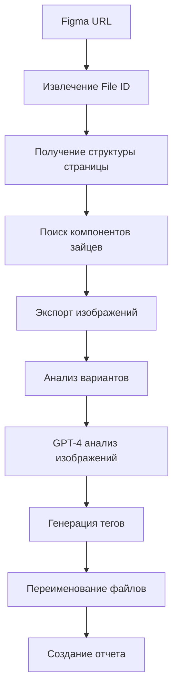

# Интеграция Figma API для обработки "Зайцы Новости"

## Обзор

Данная система автоматически обрабатывает компоненты зайцев из листа "Зайцы Новости" в Figma, анализирует их с помощью GPT-4 и генерирует корректные теги для переименования файлов.

## Архитектура решения

### Основные компоненты

1. **`figma-news-rabbits-processor.ts`** - Основной процессор
2. **`process-news-rabbits.js`** - Скрипт запуска
3. **GPT-4 Integration** - Анализ изображений и генерация тегов
4. **Variant Analysis** - Обработка вариантов компонентов

### Процесс обработки



## Использование

### 1. Настройка переменных окружения

Убедитесь, что в `.env.local` указаны:

```env
FIGMA_ACCESS_TOKEN=your_figma_token_here
OPENAI_API_KEY=your_openai_api_key
```

### 2. Веб-интерфейс (Рекомендуется)

Откройте в браузере: `http://localhost:3000/figma-processor`

- Удобный интерфейс для настройки параметров
- Отслеживание прогресса в реальном времени
- История всех задач обработки
- Управление задачами (отмена, удаление)

### 3. API Endpoints

#### Запуск обработки
```bash
curl -X POST http://localhost:3000/api/figma/process-news-rabbits \
  -H "Content-Type: application/json" \
  -d '{
    "figmaUrl": "https://www.figma.com/design/GBnGxSQlfM1XhjSkLHogk6/...",
    "context": {
      "campaign_type": "newsletter",
      "content_theme": "новости авиакомпаний",
      "target_audience": "пользователи сервиса бронирования"
    }
  }'
```

#### Проверка статуса
```bash
curl http://localhost:3000/api/figma/process-news-rabbits/{jobId}
```

#### Список всех задач
```bash
curl http://localhost:3000/api/figma/process-news-rabbits
```

### 4. Скрипт для API

```bash
# Запуск обработки
node scripts/api-process-news-rabbits.js

# Список задач
node scripts/api-process-news-rabbits.js list

# Справка
node scripts/api-process-news-rabbits.js help
```

### 5. Программное использование (Legacy)

```typescript
import { processNewsRabbits } from './src/agent/tools/figma-news-rabbits-processor';

const result = await processNewsRabbits({
  figmaUrl: 'https://www.figma.com/design/GBnGxSQlfM1XhjSkLHogk6/...',
  outputDirectory: './output',
  context: {
    campaign_type: 'newsletter',
    content_theme: 'новости авиакомпаний',
    target_audience: 'пользователи сервиса бронирования'
  }
});
```

## Структура выходных данных

```
news-rabbits-output-{timestamp}/
├── заяц-новости-радостный.png          # Переименованные основные файлы
├── заяц-подборка-нейтральный.png
├── заяц-общие-дружелюбный.png
├── variants/                           # Директория с вариантами
│   ├── заяц-новости/
│   │   ├── variant-1-default.png
│   │   ├── variant-2-active.png
│   │   └── variant-3-hover.png
│   └── заяц-подборка/
│       ├── variant-1-default.png
│       └── variant-2-active.png
└── processing-report.json              # Детальный отчет
```

## Обработка вариантов

### Типы вариантов

1. **COMPONENT_SET** - Набор компонентов с разными состояниями
2. **Property-based variants** - Варианты на основе свойств Figma
3. **Auto-detected variants** - Автоматически обнаруженные варианты

### Алгоритм выбора варианта

```typescript
function selectBestVariant(variants: VariantInfo[]): VariantInfo {
  // 1. Сортировка по confidence score
  // 2. Приоритет для "default" вариантов
  // 3. Учет контекста кампании
  // 4. Анализ свойств компонента
}
```

## GPT-4 Анализ изображений

### Промпт для анализа

Система отправляет в GPT-4:
- Изображение в base64
- Контекст кампании
- Название компонента
- Требования к тегам

### Формат ответа

```json
{
  "suggestedTags": ["заяц", "новости", "радостный"],
  "contentDescription": "Изображение зайца с радостным выражением",
  "emotionalTone": "позитивный",
  "usageContext": ["newsletter", "email-маркетинг"],
  "confidence": 0.95,
  "reasoning": "Заяц выглядит радостным, подходит для новостных рассылок"
}
```

## Генерация тегов

### Правила тегирования

1. **Базовый тег**: `заяц` (всегда присутствует)
2. **Тип контента**: `новости`, `подборка`, `общие`, `вопрос-ответ`
3. **Эмоциональный тон**: `радостный`, `нейтральный`, `озадаченный`, `грустный`
4. **Контекст**: на основе campaign_type

### Примеры генерации имен

| Оригинальное имя | Теги | Новое имя |
|------------------|------|-----------|
| "заяц Новости 01" | ["заяц", "новости", "радостный"] | `заяц-новости-радостный.png` |
| "заяц Подборка 15" | ["заяц", "подборка", "нейтральный"] | `заяц-подборка-нейтральный.png` |
| "заяц Общие 09" | ["заяц", "общие", "дружелюбный"] | `заяц-общие-дружелюбный.png` |

## Обработка ошибок

### Fallback механизм

Если GPT-4 недоступен:
1. Анализ имени компонента
2. Извлечение ключевых слов
3. Применение базовых правил тегирования
4. Confidence score = 0.7

### Типы ошибок

1. **Figma API ошибки**: Неверный токен, файл не найден
2. **GPT-4 ошибки**: Превышение лимитов, неверный формат ответа
3. **Файловые ошибки**: Проблемы с сохранением, недостаток места

## Мониторинг и отчетность

### Метрики обработки

- Общее количество обработанных ассетов
- Количество ассетов с вариантами
- Средний confidence score GPT-4
- Уникальные теги
- Время обработки

### Отчет processing-report.json

```json
{
  "summary": {
    "totalAssets": 12,
    "assetsWithVariants": 4,
    "totalVariants": 18,
    "uniqueTags": ["заяц", "новости", "подборка", "радостный", "нейтральный"],
    "averageConfidence": 0.87
  },
  "assets": [
    {
      "originalName": "заяц Новости 01",
      "newName": "заяц-новости-радостный",
      "tags": ["заяц", "новости", "радостный"],
      "hasVariants": true,
      "variantCount": 3,
      "aiConfidence": 0.95,
      "emotionalTone": "позитивный"
    }
  ]
}
```

## Интеграция с существующей системой

### Использование в агенте

```typescript
// В agent.ts
import { processNewsRabbits } from './tools/figma-news-rabbits-processor';

// Добавить в список доступных инструментов
const tools = [
  // ... существующие инструменты
  {
    name: 'process_news_rabbits',
    description: 'Обработка компонентов зайцев из Figma с генерацией тегов',
    handler: processNewsRabbits
  }
];
```

### Расширение для других типов компонентов

Система легко расширяется для обработки других типов компонентов:

1. Создать новый процессор (например, `figma-icons-processor.ts`)
2. Адаптировать логику поиска компонентов
3. Настроить промпты для GPT-4
4. Добавить специфичные правила тегирования

## Оптимизация производительности

### Параллельная обработка

- Экспорт изображений батчами
- Параллельный анализ GPT-4
- Асинхронное сохранение файлов

### Кэширование

- Кэш результатов GPT-4 анализа
- Локальное кэширование экспортированных изображений
- Повторное использование анализа вариантов

## Безопасность

### Обработка токенов

- Безопасное хранение Figma токенов
- Ротация API ключей
- Логирование без чувствительных данных

### Валидация входных данных

- Проверка Figma URL
- Валидация параметров контекста
- Санитизация имен файлов

## Будущие улучшения

1. **Автоматическое обнаружение новых компонентов**
2. **Интеграция с системой версионирования**
3. **Поддержка множественных языков**
4. **Автоматическая оптимизация изображений**
5. **Интеграция с CDN для распределения ассетов** 