# FINAL SYSTEM DATA FLOW DIAGRAMS
## Email-Makers Complete Visual Architecture

*Generated: January 15, 2025*
*Phase 3 Analysis - Final Documentation*

---

## 🎯 OVERVIEW

This document provides comprehensive visual diagrams showing data flow between all 47 functions in the Email-Makers system. These diagrams serve as the definitive visual reference for understanding system operation, data transformation, and performance characteristics.

---

## 📊 1. MASTER SYSTEM DATA FLOW

### Complete 47-Function System Architecture

```mermaid
graph TD
    %% ORCHESTRATOR
    OR["🎯 ORCHESTRATOR<br/>Entry Point"]
    
    %% DATA COLLECTION SPECIALIST (10 functions)
    OR --> DC1["📥 CREATE_CAMPAIGN_FOLDER<br/>2KB → 3KB"]
    DC1 --> DC2["📋 PROCESS_BRIEF<br/>3KB → 5KB"]
    DC2 --> DC3["🔍 EXTRACT_REQUIREMENTS<br/>5KB → 7KB"]
    DC3 --> DC4["📊 ANALYZE_TARGET_AUDIENCE<br/>7KB → 9KB"]
    DC4 --> DC5["🎯 DETERMINE_CONTENT_STRATEGY<br/>9KB → 11KB"]
    DC5 --> DC6["📝 CREATE_CONTENT_OUTLINE<br/>11KB → 13KB"]
    DC6 --> DC7["💾 CACHE_ANALYSIS_RESULTS<br/>13KB → 13KB"]
    DC7 --> DC8["🔄 UPDATE_CONTEXT<br/>13KB → 14KB"]
    DC8 --> DC9["📤 PREPARE_HANDOFF<br/>14KB → 15KB"]
    DC9 --> DC10["✅ VALIDATE_DATA_COLLECTION<br/>15KB → 15KB"]
    
    %% CONTENT SPECIALIST (9 functions)
    DC10 --> CS1["📥 RECEIVE_DATA_HANDOFF<br/>15KB → 16KB"]
    CS1 --> CS2["🎨 GENERATE_EMAIL_CONTENT<br/>16KB → 20KB<br/>🤖 OpenAI GPT-4o-mini"]
    CS2 --> CS3["✈️ INTEGRATE_TRAVEL_DATA<br/>20KB → 22KB<br/>🌐 Kupibilet API v2"]
    CS3 --> CS4["🔄 OPTIMIZE_CONTENT<br/>22KB → 24KB<br/>🤖 OpenAI GPT-4o-mini"]
    CS4 --> CS5["📱 ADAPT_FOR_MOBILE<br/>24KB → 25KB"]
    CS5 --> CS6["🎭 PERSONALIZE_CONTENT<br/>25KB → 26KB<br/>🤖 OpenAI GPT-4o-mini"]
    CS6 --> CS7["📤 FINALIZE_CONTENT<br/>26KB → 27KB"]
    CS7 --> CS8["🔄 UPDATE_CONTEXT<br/>27KB → 28KB"]
    CS8 --> CS9["📋 PREPARE_DESIGN_HANDOFF<br/>28KB → 29KB"]
    
    %% DESIGN SPECIALIST V3 (14 functions)
    CS9 --> DS1["📥 RECEIVE_CONTENT_HANDOFF<br/>29KB → 30KB"]
    DS1 --> DS2["🎨 CREATE_DESIGN_BRIEF<br/>30KB → 31KB"]
    DS2 --> DS3["🖼️ GENERATE_VISUAL_CONCEPTS<br/>31KB → 32KB"]
    DS3 --> DS4["🎭 APPLY_BRAND_GUIDELINES<br/>32KB → 33KB"]
    DS4 --> DS5["📐 CREATE_LAYOUT_STRUCTURE<br/>33KB → 34KB"]
    DS5 --> DS6["🏗️ GENERATE_MJML_TEMPLATE<br/>34KB → 36KB"]
    DS6 --> DS7["🎨 APPLY_STYLING<br/>36KB → 37KB"]
    DS7 --> DS8["📱 IMPLEMENT_RESPONSIVE_DESIGN<br/>37KB → 38KB"]
    DS8 --> DS9["🌙 ADD_DARK_MODE_SUPPORT<br/>38KB → 39KB"]
    DS9 --> DS10["🔍 VALIDATE_DESIGN_AI<br/>39KB → 39KB<br/>🤖 Internal AI"]
    DS10 --> DS11["📊 OPTIMIZE_PERFORMANCE<br/>39KB → 40KB"]
    DS11 --> DS12["💾 SAVE_DESIGN_ASSETS<br/>40KB → 40KB"]
    DS12 --> DS13["🔄 UPDATE_CONTEXT<br/>40KB → 40KB"]
    DS13 --> DS14["📋 PREPARE_QUALITY_HANDOFF<br/>40KB → 40KB"]
    
    %% QUALITY SPECIALIST (10 functions)
    DS14 --> QS1["📥 RECEIVE_DESIGN_HANDOFF<br/>40KB → 40KB"]
    QS1 --> QS2["🔍 VALIDATE_HTML_STRUCTURE<br/>40KB → 40KB"]
    QS2 --> QS3["📧 TEST_EMAIL_CLIENTS<br/>40KB → 40KB"]
    QS3 --> QS4["♿ CHECK_ACCESSIBILITY<br/>40KB → 40KB"]
    QS4 --> QS5["📱 VALIDATE_RESPONSIVE_DESIGN<br/>40KB → 40KB"]
    QS5 --> QS6["🌙 TEST_DARK_MODE<br/>40KB → 40KB"]
    QS6 --> QS7["⚡ ANALYZE_PERFORMANCE<br/>40KB → 40KB"]
    QS7 --> QS8["📊 GENERATE_QUALITY_REPORT<br/>40KB → 40KB"]
    QS8 --> QS9["🔄 UPDATE_CONTEXT<br/>40KB → 40KB"]
    QS9 --> QS10["📋 PREPARE_DELIVERY_HANDOFF<br/>40KB → 40KB"]
    
    %% DELIVERY SPECIALIST (4 functions)
    QS10 --> DL1["📥 RECEIVE_QUALITY_HANDOFF<br/>40KB → 40KB"]
    DL1 --> DL2["📦 PACKAGE_FINAL_TEMPLATE<br/>40KB → 40KB"]
    DL2 --> DL3["📁 CREATE_EXPORT_PACKAGE<br/>40KB → 40KB"]
    DL3 --> DL4["✅ FINALIZE_DELIVERY<br/>40KB → 40KB"]
    
    %% EXTERNAL INTEGRATIONS
    EXT1["🤖 OpenAI GPT-4o-mini<br/>3 integrations<br/>41-63s processing"]
    EXT2["🌐 Kupibilet API v2<br/>1 integration<br/>2-5s response"]
    EXT3["💾 File System<br/>30+ operations<br/>5-10s total"]
    
    CS2 -.-> EXT1
    CS4 -.-> EXT1
    CS6 -.-> EXT1
    CS3 -.-> EXT2
    DC1 -.-> EXT3
    DS12 -.-> EXT3
    DL2 -.-> EXT3
    
    %% PERFORMANCE INDICATORS
    PERF1["⚠️ PERFORMANCE BOTTLENECK<br/>Context Growth: 2KB → 40KB<br/>20x increase"]
    PERF2["🕐 TOTAL EXECUTION TIME<br/>68-98 seconds<br/>Target: 30-45 seconds"]
    
    DS14 -.-> PERF1
    DL4 -.-> PERF2
    
    %% STYLING
    style OR fill:#ff6b6b,stroke:#e55555,color:white,stroke-width:3px
    style DC1 fill:#4ecdc4,stroke:#45b7aa,color:white
    style DC10 fill:#4ecdc4,stroke:#45b7aa,color:white
    style CS1 fill:#45b7d1,stroke:#3a9bc1,color:white
    style CS9 fill:#45b7d1,stroke:#3a9bc1,color:white
    style DS1 fill:#96ceb4,stroke:#85b7a3,color:white
    style DS14 fill:#96ceb4,stroke:#85b7a3,color:white
    style QS1 fill:#feca57,stroke:#fd9644,color:white
    style QS10 fill:#feca57,stroke:#fd9644,color:white
    style DL1 fill:#ff9ff3,stroke:#f368e0,color:white
    style DL4 fill:#ff9ff3,stroke:#f368e0,color:white
    style EXT1 fill:#ff6b6b,stroke:#e55555,color:white
    style EXT2 fill:#ff6b6b,stroke:#e55555,color:white
    style EXT3 fill:#ff6b6b,stroke:#e55555,color:white
    style PERF1 fill:#ff4757,stroke:#ff3838,color:white
    style PERF2 fill:#ff4757,stroke:#ff3838,color:white
```

---

## 📈 2. DATA TRANSFORMATION PIPELINE

### Context Evolution Through System

```mermaid
graph LR
    subgraph "📊 DATA EVOLUTION STAGES"
        STAGE1["🌱 INITIAL<br/>2KB<br/>Brief Text"]
        STAGE2["📋 ANALYSIS<br/>15KB<br/>+Requirements<br/>+Audience<br/>+Strategy"]
        STAGE3["📝 CONTENT<br/>29KB<br/>+Email Content<br/>+Travel Data<br/>+Personalization"]
        STAGE4["🎨 DESIGN<br/>40KB<br/>+MJML Template<br/>+Styling<br/>+Assets"]
        STAGE5["✅ VALIDATED<br/>40KB<br/>+Quality Reports<br/>+Test Results"]
        STAGE6["📦 DELIVERED<br/>40KB<br/>+Export Package<br/>+Final Assets"]
    end
    
    subgraph "🔄 TRANSFORMATION DETAILS"
        T1["📥 INPUT PROCESSING<br/>• Brief parsing<br/>• Requirement extraction<br/>• Audience analysis"]
        T2["🤖 AI ENHANCEMENT<br/>• Content generation<br/>• Optimization<br/>• Personalization"]
        T3["🎨 DESIGN APPLICATION<br/>• MJML generation<br/>• Brand application<br/>• Responsive design"]
        T4["✅ QUALITY VALIDATION<br/>• Multi-client testing<br/>• Accessibility checks<br/>• Performance analysis"]
        T5["📦 FINAL PACKAGING<br/>• Asset compilation<br/>• Export preparation<br/>• Delivery finalization"]
    end
    
    STAGE1 --> T1
    T1 --> STAGE2
    STAGE2 --> T2
    T2 --> STAGE3
    STAGE3 --> T3
    T3 --> STAGE4
    STAGE4 --> T4
    T4 --> STAGE5
    STAGE5 --> T5
    T5 --> STAGE6
    
    %% PERFORMANCE METRICS
    PERF_M1["⏱️ TIME: 0-20s<br/>💾 SIZE: 2-15KB"]
    PERF_M2["⏱️ TIME: 20-45s<br/>💾 SIZE: 15-29KB<br/>🤖 3 AI calls"]
    PERF_M3["⏱️ TIME: 45-65s<br/>💾 SIZE: 29-40KB<br/>🎨 Design generation"]
    PERF_M4["⏱️ TIME: 65-85s<br/>💾 SIZE: 40KB<br/>✅ Multi-validation"]
    PERF_M5["⏱️ TIME: 85-98s<br/>💾 SIZE: 40KB<br/>📦 Final packaging"]
    
    STAGE2 -.-> PERF_M1
    STAGE3 -.-> PERF_M2
    STAGE4 -.-> PERF_M3
    STAGE5 -.-> PERF_M4
    STAGE6 -.-> PERF_M5
    
    style STAGE1 fill:#e8f5e8,stroke:#4caf50,color:black
    style STAGE2 fill:#e3f2fd,stroke:#2196f3,color:black
    style STAGE3 fill:#f3e5f5,stroke:#9c27b0,color:black
    style STAGE4 fill:#fff3e0,stroke:#ff9800,color:black
    style STAGE5 fill:#e8f5e8,stroke:#4caf50,color:black
    style STAGE6 fill:#f1f8e9,stroke:#8bc34a,color:black
```

---

## 🔗 3. INTER-SPECIALIST DATA HANDOFFS

### Detailed Function-to-Function Communication

```mermaid
graph TD
    subgraph "📊 DATA COLLECTION → CONTENT"
        DCH["📤 DATA COLLECTION HANDOFF<br/>Function: prepare_handoff()"]
        DCH_DATA["📋 HANDOFF DATA<br/>• Campaign ID<br/>• Requirements analysis<br/>• Target audience<br/>• Content strategy<br/>• Outline structure<br/>SIZE: 15KB"]
        CSR["📥 CONTENT RECEIVE<br/>Function: receive_data_handoff()"]
        DCH --> DCH_DATA --> CSR
    end
    
    subgraph "📝 CONTENT → DESIGN"
        CDH["📤 CONTENT HANDOFF<br/>Function: prepare_design_handoff()"]
        CDH_DATA["📋 HANDOFF DATA<br/>• Generated content<br/>• Travel data integration<br/>• Mobile adaptations<br/>• Personalization rules<br/>• Content metadata<br/>SIZE: 29KB"]
        DSR["📥 DESIGN RECEIVE<br/>Function: receive_content_handoff()"]
        CDH --> CDH_DATA --> DSR
    end
    
    subgraph "🎨 DESIGN → QUALITY"
        DQH["📤 DESIGN HANDOFF<br/>Function: prepare_quality_handoff()"]
        DQH_DATA["📋 HANDOFF DATA<br/>• MJML template<br/>• Design assets<br/>• Brand guidelines<br/>• Responsive rules<br/>• Dark mode configs<br/>SIZE: 40KB"]
        QSR["📥 QUALITY RECEIVE<br/>Function: receive_design_handoff()"]
        DQH --> DQH_DATA --> QSR
    end
    
    subgraph "✅ QUALITY → DELIVERY"
        QDH["📤 QUALITY HANDOFF<br/>Function: prepare_delivery_handoff()"]
        QDH_DATA["📋 HANDOFF DATA<br/>• Validated template<br/>• Quality reports<br/>• Test results<br/>• Performance metrics<br/>• Compliance status<br/>SIZE: 40KB"]
        DLR["📥 DELIVERY RECEIVE<br/>Function: receive_quality_handoff()"]
        QDH --> QDH_DATA --> DLR
    end
    
    %% VALIDATION POINTS
    V1["🔍 VALIDATION<br/>validate_data_collection()"]
    V2["🔍 VALIDATION<br/>Content completeness"]
    V3["🔍 VALIDATION<br/>validate_design_ai()"]
    V4["🔍 VALIDATION<br/>Multi-dimensional QA"]
    
    CSR --> V1
    DSR --> V2
    QSR --> V3
    DLR --> V4
    
    %% ERROR HANDLING
    ERR1["❌ ERROR RECOVERY<br/>Rollback to previous state"]
    ERR2["❌ ERROR RECOVERY<br/>Content regeneration"]
    ERR3["❌ ERROR RECOVERY<br/>Design iteration"]
    ERR4["❌ ERROR RECOVERY<br/>Quality re-validation"]
    
    V1 -.-> ERR1
    V2 -.-> ERR2
    V3 -.-> ERR3
    V4 -.-> ERR4
    
    style DCH fill:#4ecdc4,stroke:#45b7aa,color:white
    style CDH fill:#45b7d1,stroke:#3a9bc1,color:white
    style DQH fill:#96ceb4,stroke:#85b7a3,color:white
    style QDH fill:#feca57,stroke:#fd9644,color:white
    style DCH_DATA fill:#e8f8f5,stroke:#4ecdc4,color:black
    style CDH_DATA fill:#e3f2fd,stroke:#45b7d1,color:black
    style DQH_DATA fill:#f1f8e9,stroke:#96ceb4,color:black
    style QDH_DATA fill:#fff8e1,stroke:#feca57,color:black
```

---

## 🚀 4. PERFORMANCE BOTTLENECK ANALYSIS

### Critical Path and Optimization Opportunities

```mermaid
graph TD
    subgraph "⚡ PERFORMANCE CRITICAL PATH"
        CP1["🚀 START<br/>0s | 2KB"]
        CP2["📊 Data Analysis<br/>20s | 15KB<br/>CACHE OPPORTUNITY"]
        CP3["🤖 AI Content Gen<br/>45s | 29KB<br/>PARALLELIZATION"]
        CP4["🎨 Design Creation<br/>65s | 40KB<br/>TEMPLATE CACHE"]
        CP5["✅ Quality Testing<br/>85s | 40KB<br/>BATCH VALIDATION"]
        CP6["📦 Final Delivery<br/>98s | 40KB<br/>COMPRESSION"]
    end
    
    subgraph "🔍 BOTTLENECK IDENTIFICATION"
        B1["🐌 CONTEXT GROWTH<br/>20x increase (2KB→40KB)<br/>💡 60-70% reduction potential"]
        B2["🕐 AI PROCESSING<br/>41-63s sequential calls<br/>💡 55-60% parallel improvement"]
        B3["💾 FILE OPERATIONS<br/>30+ I/O operations<br/>💡 50-60% reduction potential"]
        B4["🌐 API LATENCY<br/>7 external calls<br/>💡 50-60% caching improvement"]
    end
    
    subgraph "🚀 OPTIMIZATION STRATEGIES"
        O1["⚡ IMMEDIATE (0-30 days)<br/>• Context compression<br/>• AI call parallelization<br/>• File batch operations"]
        O2["📈 MEDIUM-TERM (1-3 months)<br/>• Advanced caching<br/>• API optimization<br/>• Performance monitoring"]
        O3["🔮 LONG-TERM (3-6 months)<br/>• Architecture redesign<br/>• AI model optimization<br/>• Distributed processing"]
    end
    
    CP1 --> CP2 --> CP3 --> CP4 --> CP5 --> CP6
    
    CP2 -.-> B1
    CP3 -.-> B2
    CP4 -.-> B3
    CP5 -.-> B4
    
    B1 -.-> O1
    B2 -.-> O1
    B3 -.-> O2
    B4 -.-> O3
    
    %% TARGET METRICS
    TARGET["🎯 OPTIMIZATION TARGET<br/>Current: 68-98s | 40KB<br/>Target: 30-45s | 15KB<br/>Improvement: 50-80%"]
    
    CP6 -.-> TARGET
    
    style CP1 fill:#4ecdc4,stroke:#45b7aa,color:white
    style CP6 fill:#ff9ff3,stroke:#f368e0,color:white
    style B1 fill:#ff6b6b,stroke:#e55555,color:white
    style B2 fill:#ff6b6b,stroke:#e55555,color:white
    style B3 fill:#ff6b6b,stroke:#e55555,color:white
    style B4 fill:#ff6b6b,stroke:#e55555,color:white
    style O1 fill:#4caf50,stroke:#45a049,color:white
    style O2 fill:#ff9800,stroke:#f57c00,color:white
    style O3 fill:#9c27b0,stroke:#7b1fa2,color:white
    style TARGET fill:#2196f3,stroke:#1976d2,color:white
```

---

## 🌐 5. EXTERNAL INTEGRATION ARCHITECTURE

### API Dependencies and Data Flow

```mermaid
graph TD
    subgraph "🏗️ SYSTEM CORE"
        CORE["💻 EMAIL-MAKERS CORE<br/>47 Functions | 5 Specialists"]
    end
    
    subgraph "🤖 AI INTEGRATIONS"
        AI1["🧠 OpenAI GPT-4o-mini<br/>Content Generation<br/>Function: generate_email_content()"]
        AI2["🔧 OpenAI GPT-4o-mini<br/>Content Optimization<br/>Function: optimize_content()"]
        AI3["🎭 OpenAI GPT-4o-mini<br/>Personalization<br/>Function: personalize_content()"]
        AI4["✅ Internal AI<br/>Design Validation<br/>Function: validate_design_ai()"]
    end
    
    subgraph "🌐 EXTERNAL APIs"
        EXT_API["✈️ Kupibilet API v2<br/>Travel Data Integration<br/>Function: integrate_travel_data()"]
    end
    
    subgraph "💾 FILE SYSTEM"
        FS1["📁 Campaign Folder<br/>Function: create_campaign_folder()"]
        FS2["💾 Asset Storage<br/>Function: save_design_assets()"]
        FS3["📦 Export Package<br/>Function: create_export_package()"]
    end
    
    subgraph "🔄 DATA FLOW PATTERNS"
        DF1["📥 INPUT PROCESSING<br/>Brief → Requirements"]
        DF2["🤖 AI ENHANCEMENT<br/>Content → Optimized Content"]
        DF3["🎨 DESIGN GENERATION<br/>Content → MJML Template"]
        DF4["✅ VALIDATION<br/>Template → Validated Output"]
        DF5["📦 PACKAGING<br/>Assets → Export Package"]
    end
    
    %% CONNECTIONS
    CORE --> AI1
    CORE --> AI2
    CORE --> AI3
    CORE --> AI4
    CORE --> EXT_API
    CORE --> FS1
    CORE --> FS2
    CORE --> FS3
    
    %% DATA FLOW
    DF1 --> DF2
    DF2 --> DF3
    DF3 --> DF4
    DF4 --> DF5
    
    %% INTEGRATION DETAILS
    AI1 -.-> DF2
    AI2 -.-> DF2
    AI3 -.-> DF2
    EXT_API -.-> DF2
    AI4 -.-> DF4
    FS1 -.-> DF1
    FS2 -.-> DF3
    FS3 -.-> DF5
    
    %% PERFORMANCE METRICS
    PERF_AI["⏱️ AI PROCESSING<br/>Total: 41-63s<br/>Calls: 3 sequential<br/>Optimization: Parallel execution"]
    PERF_API["⏱️ API CALLS<br/>Total: 2-5s<br/>Calls: 1 per campaign<br/>Optimization: Response caching"]
    PERF_FS["⏱️ FILE OPS<br/>Total: 5-10s<br/>Operations: 30+<br/>Optimization: Batch processing"]
    
    AI1 -.-> PERF_AI
    EXT_API -.-> PERF_API
    FS1 -.-> PERF_FS
    
    %% ERROR HANDLING
    ERR_AI["❌ AI FAILURES<br/>• Rate limiting<br/>• Content quality<br/>• Response timeout"]
    ERR_API["❌ API FAILURES<br/>• Service unavailable<br/>• Invalid responses<br/>• Network errors"]
    ERR_FS["❌ FILE FAILURES<br/>• Permission denied<br/>• Storage full<br/>• Corruption errors"]
    
    AI1 -.-> ERR_AI
    EXT_API -.-> ERR_API
    FS1 -.-> ERR_FS
    
    style CORE fill:#2196f3,stroke:#1976d2,color:white,stroke-width:3px
    style AI1 fill:#ff6b6b,stroke:#e55555,color:white
    style AI2 fill:#ff6b6b,stroke:#e55555,color:white
    style AI3 fill:#ff6b6b,stroke:#e55555,color:white
    style AI4 fill:#4caf50,stroke:#45a049,color:white
    style EXT_API fill:#ff9800,stroke:#f57c00,color:white
    style FS1 fill:#9c27b0,stroke:#7b1fa2,color:white
    style FS2 fill:#9c27b0,stroke:#7b1fa2,color:white
    style FS3 fill:#9c27b0,stroke:#7b1fa2,color:white
```

---

## 🔄 6. ERROR FLOW AND RECOVERY PATTERNS

### Failure Points and Recovery Strategies

```mermaid
graph TD
    subgraph "🚀 NORMAL EXECUTION FLOW"
        N1["🎯 Orchestrator Start"]
        N2["📊 Data Collection"]
        N3["📝 Content Generation"]
        N4["🎨 Design Creation"]
        N5["✅ Quality Validation"]
        N6["📦 Delivery Packaging"]
        N7["✅ Success Completion"]
    end
    
    subgraph "❌ ERROR DETECTION POINTS"
        E1["⚠️ Brief Processing Error<br/>Invalid input format"]
        E2["⚠️ Content Generation Error<br/>AI service failure"]
        E3["⚠️ Design Creation Error<br/>Template generation failure"]
        E4["⚠️ Quality Validation Error<br/>Testing framework failure"]
        E5["⚠️ Delivery Error<br/>Export packaging failure"]
    end
    
    subgraph "🔄 RECOVERY STRATEGIES"
        R1["🔧 INPUT SANITIZATION<br/>• Format validation<br/>• Content cleaning<br/>• Fallback processing"]
        R2["🔧 AI RETRY LOGIC<br/>• Exponential backoff<br/>• Alternative models<br/>• Content fallbacks"]
        R3["🔧 DESIGN REGENERATION<br/>• Template retry<br/>• Simplified layouts<br/>• Default styling"]
        R4["🔧 QUALITY BYPASS<br/>• Essential tests only<br/>• Warning flags<br/>• Conditional delivery"]
        R5["🔧 MANUAL PACKAGING<br/>• Basic export<br/>• Asset verification<br/>• Partial delivery"]
    end
    
    subgraph "📊 MONITORING & ALERTS"
        M1["🔍 ERROR TRACKING<br/>• Error classification<br/>• Frequency analysis<br/>• Performance impact"]
        M2["📈 RECOVERY METRICS<br/>• Success rate<br/>• Recovery time<br/>• Resource usage"]
        M3["🚨 ALERT SYSTEM<br/>• Critical failures<br/>• Performance degradation<br/>• Resource exhaustion"]
    end
    
    %% NORMAL FLOW
    N1 --> N2 --> N3 --> N4 --> N5 --> N6 --> N7
    
    %% ERROR TRIGGERS
    N2 -.-> E1
    N3 -.-> E2
    N4 -.-> E3
    N5 -.-> E4
    N6 -.-> E5
    
    %% RECOVERY FLOWS
    E1 --> R1 --> N2
    E2 --> R2 --> N3
    E3 --> R3 --> N4
    E4 --> R4 --> N5
    E5 --> R5 --> N6
    
    %% MONITORING
    E1 & E2 & E3 & E4 & E5 --> M1
    R1 & R2 & R3 & R4 & R5 --> M2
    M1 & M2 --> M3
    
    %% FAILURE ESCALATION
    ESCALATION["🚨 ESCALATION TRIGGERS<br/>• 3+ consecutive failures<br/>• Critical system errors<br/>• Resource exhaustion<br/>• Manual intervention required"]
    
    E1 & E2 & E3 & E4 & E5 -.-> ESCALATION
    
    %% RECOVERY SUCCESS PATHS
    R1 -.-> N3
    R2 -.-> N4
    R3 -.-> N5
    R4 -.-> N6
    R5 -.-> N7
    
    style N1 fill:#4caf50,stroke:#45a049,color:white
    style N7 fill:#4caf50,stroke:#45a049,color:white
    style E1 fill:#ff6b6b,stroke:#e55555,color:white
    style E2 fill:#ff6b6b,stroke:#e55555,color:white
    style E3 fill:#ff6b6b,stroke:#e55555,color:white
    style E4 fill:#ff6b6b,stroke:#e55555,color:white
    style E5 fill:#ff6b6b,stroke:#e55555,color:white
    style R1 fill:#ff9800,stroke:#f57c00,color:white
    style R2 fill:#ff9800,stroke:#f57c00,color:white
    style R3 fill:#ff9800,stroke:#f57c00,color:white
    style R4 fill:#ff9800,stroke:#f57c00,color:white
    style R5 fill:#ff9800,stroke:#f57c00,color:white
    style ESCALATION fill:#9c27b0,stroke:#7b1fa2,color:white
```

---

## 📋 7. FUNCTION DEPENDENCY MATRIX

### Complete 47-Function Interaction Map

```mermaid
graph TD
    subgraph "📊 DATA COLLECTION CLUSTER (10 functions)"
        DC_CLUSTER["🗂️ DATA COLLECTION<br/>Functions 1-10<br/>Dependencies: 0 external<br/>Performance: 20s, 2KB→15KB"]
        
        DC_F1["create_campaign_folder()"]
        DC_F2["process_brief()"]
        DC_F3["extract_requirements()"]
        DC_F4["analyze_target_audience()"]
        DC_F5["determine_content_strategy()"]
        DC_F6["create_content_outline()"]
        DC_F7["cache_analysis_results()"]
        DC_F8["update_context()"]
        DC_F9["prepare_handoff()"]
        DC_F10["validate_data_collection()"]
    end
    
    subgraph "📝 CONTENT CLUSTER (9 functions)"
        CS_CLUSTER["📄 CONTENT GENERATION<br/>Functions 11-19<br/>Dependencies: 3 OpenAI, 1 Kupibilet<br/>Performance: 25s, 15KB→29KB"]
        
        CS_F1["receive_data_handoff()"]
        CS_F2["generate_email_content()"]
        CS_F3["integrate_travel_data()"]
        CS_F4["optimize_content()"]
        CS_F5["adapt_for_mobile()"]
        CS_F6["personalize_content()"]
        CS_F7["finalize_content()"]
        CS_F8["update_context()"]
        CS_F9["prepare_design_handoff()"]
    end
    
    subgraph "🎨 DESIGN CLUSTER (14 functions)"
        DS_CLUSTER["🎭 DESIGN GENERATION<br/>Functions 20-33<br/>Dependencies: 1 AI validation<br/>Performance: 20s, 29KB→40KB"]
        
        DS_F1["receive_content_handoff()"]
        DS_F2["create_design_brief()"]
        DS_F3["generate_visual_concepts()"]
        DS_F4["apply_brand_guidelines()"]
        DS_F5["create_layout_structure()"]
        DS_F6["generate_mjml_template()"]
        DS_F7["apply_styling()"]
        DS_F8["implement_responsive_design()"]
        DS_F9["add_dark_mode_support()"]
        DS_F10["validate_design_ai()"]
        DS_F11["optimize_performance()"]
        DS_F12["save_design_assets()"]
        DS_F13["update_context()"]
        DS_F14["prepare_quality_handoff()"]
    end
    
    subgraph "✅ QUALITY CLUSTER (10 functions)"
        QS_CLUSTER["🔍 QUALITY ASSURANCE<br/>Functions 34-43<br/>Dependencies: 0 external<br/>Performance: 20s, 40KB maintained"]
        
        QS_F1["receive_design_handoff()"]
        QS_F2["validate_html_structure()"]
        QS_F3["test_email_clients()"]
        QS_F4["check_accessibility()"]
        QS_F5["validate_responsive_design()"]
        QS_F6["test_dark_mode()"]
        QS_F7["analyze_performance()"]
        QS_F8["generate_quality_report()"]
        QS_F9["update_context()"]
        QS_F10["prepare_delivery_handoff()"]
    end
    
    subgraph "📦 DELIVERY CLUSTER (4 functions)"
        DL_CLUSTER["🚚 FINAL DELIVERY<br/>Functions 44-47<br/>Dependencies: 0 external<br/>Performance: 13s, 40KB maintained"]
        
        DL_F1["receive_quality_handoff()"]
        DL_F2["package_final_template()"]
        DL_F3["create_export_package()"]
        DL_F4["finalize_delivery()"]
    end
    
    %% CLUSTER CONNECTIONS
    DC_CLUSTER --> CS_CLUSTER
    CS_CLUSTER --> DS_CLUSTER
    DS_CLUSTER --> QS_CLUSTER
    QS_CLUSTER --> DL_CLUSTER
    
    %% CRITICAL DEPENDENCIES
    CRITICAL_DEP["🔴 CRITICAL DEPENDENCIES<br/>• 3× OpenAI GPT-4o-mini calls<br/>• 1× Kupibilet API v2 call<br/>• 1× Internal AI validation<br/>• 30+ File system operations"]
    
    CS_CLUSTER -.-> CRITICAL_DEP
    DS_CLUSTER -.-> CRITICAL_DEP
    
    %% PERFORMANCE ANALYSIS
    PERF_ANALYSIS["📊 PERFORMANCE PROFILE<br/>Total Time: 68-98 seconds<br/>Total Data: 2KB → 40KB<br/>External Calls: 5<br/>File Operations: 30+"]
    
    DL_CLUSTER --> PERF_ANALYSIS
    
    style DC_CLUSTER fill:#4ecdc4,stroke:#45b7aa,color:white
    style CS_CLUSTER fill:#45b7d1,stroke:#3a9bc1,color:white
    style DS_CLUSTER fill:#96ceb4,stroke:#85b7a3,color:white
    style QS_CLUSTER fill:#feca57,stroke:#fd9644,color:white
    style DL_CLUSTER fill:#ff9ff3,stroke:#f368e0,color:white
    style CRITICAL_DEP fill:#ff6b6b,stroke:#e55555,color:white
    style PERF_ANALYSIS fill:#2196f3,stroke:#1976d2,color:white
```

---

## 🎯 8. OPTIMIZATION ROADMAP

### Strategic Improvement Plan

```mermaid
graph TD
    subgraph "📊 CURRENT STATE ANALYSIS"
        CURRENT["🔍 CURRENT PERFORMANCE<br/>⏱️ Time: 68-98 seconds<br/>💾 Data: 2KB → 40KB growth<br/>🤖 AI Calls: 5 sequential<br/>💾 File Ops: 30+ operations<br/>🌐 API Calls: 7 external"]
    end
    
    subgraph "🚀 PHASE 1: IMMEDIATE WINS (0-30 days)"
        P1_1["⚡ CONTEXT OPTIMIZATION<br/>• Compress data structures<br/>• Remove redundant info<br/>• Implement smart caching<br/>Target: 60-70% reduction"]
        P1_2["🔄 AI PARALLELIZATION<br/>• Concurrent API calls<br/>• Batch processing<br/>• Response streaming<br/>Target: 55-60% time reduction"]
        P1_3["📁 FILE BATCH OPS<br/>• Bulk operations<br/>• Memory caching<br/>• Reduced I/O calls<br/>Target: 50-60% reduction"]
    end
    
    subgraph "📈 PHASE 2: MEDIUM-TERM (1-3 months)"
        P2_1["🧠 SMART CACHING<br/>• Content templates<br/>• Design patterns<br/>• Quality profiles<br/>• API response cache"]
        P2_2["🔧 API OPTIMIZATION<br/>• Connection pooling<br/>• Response compression<br/>• Predictive prefetching<br/>• Error resilience"]
        P2_3["📊 MONITORING SYSTEM<br/>• Real-time metrics<br/>• Performance alerts<br/>• Bottleneck detection<br/>• Auto-scaling triggers"]
    end
    
    subgraph "🔮 PHASE 3: LONG-TERM (3-6 months)"
        P3_1["🏗️ ARCHITECTURE REDESIGN<br/>• Microservices split<br/>• Event-driven processing<br/>• Distributed caching<br/>• Horizontal scaling"]
        P3_2["🤖 AI MODEL OPTIMIZATION<br/>• Custom fine-tuned models<br/>• Edge AI deployment<br/>• Prompt optimization<br/>• Response prediction"]
        P3_3["⚡ DISTRIBUTED PROCESSING<br/>• Worker pools<br/>• Load balancing<br/>• Geographic distribution<br/>• Edge computing"]
    end
    
    subgraph "🎯 TARGET METRICS"
        TARGET_METRICS["🏆 PERFORMANCE TARGETS<br/>⏱️ Time: 30-45 seconds (50-80% improvement)<br/>💾 Data: 15KB max (62% reduction)<br/>🤖 AI: Parallel execution<br/>💾 File: Batch operations<br/>🌐 API: Cached responses"]
    end
    
    %% FLOW CONNECTIONS
    CURRENT --> P1_1
    CURRENT --> P1_2
    CURRENT --> P1_3
    
    P1_1 --> P2_1
    P1_2 --> P2_2
    P1_3 --> P2_3
    
    P2_1 --> P3_1
    P2_2 --> P3_2
    P2_3 --> P3_3
    
    P3_1 --> TARGET_METRICS
    P3_2 --> TARGET_METRICS
    P3_3 --> TARGET_METRICS
    
    %% IMPACT ANNOTATIONS
    IMPACT_1["💥 IMMEDIATE IMPACT<br/>40-60% performance gain<br/>Cost: Low<br/>Risk: Minimal"]
    IMPACT_2["📈 SUBSTANTIAL IMPACT<br/>60-75% performance gain<br/>Cost: Medium<br/>Risk: Low"]
    IMPACT_3["🚀 TRANSFORMATIONAL<br/>75-80% performance gain<br/>Cost: High<br/>Risk: Medium"]
    
    P1_1 -.-> IMPACT_1
    P2_1 -.-> IMPACT_2
    P3_1 -.-> IMPACT_3
    
    style CURRENT fill:#ff6b6b,stroke:#e55555,color:white
    style P1_1 fill:#4caf50,stroke:#45a049,color:white
    style P1_2 fill:#4caf50,stroke:#45a049,color:white
    style P1_3 fill:#4caf50,stroke:#45a049,color:white
    style P2_1 fill:#ff9800,stroke:#f57c00,color:white
    style P2_2 fill:#ff9800,stroke:#f57c00,color:white
    style P2_3 fill:#ff9800,stroke:#f57c00,color:white
    style P3_1 fill:#9c27b0,stroke:#7b1fa2,color:white
    style P3_2 fill:#9c27b0,stroke:#7b1fa2,color:white
    style P3_3 fill:#9c27b0,stroke:#7b1fa2,color:white
    style TARGET_METRICS fill:#2196f3,stroke:#1976d2,color:white
```

---

## 📋 SUMMARY

### Key Insights from Visual Analysis

#### 🎯 **SYSTEM OVERVIEW**
- **47 Functions** across 5 specialists with complete sequential data flow
- **20x Data Growth** from 2KB initial brief to 40KB final package
- **68-98 Second** total execution time with clear optimization opportunities

#### 🔍 **CRITICAL BOTTLENECKS**
1. **Context Growth**: 2KB → 40KB (20x increase) creates memory and processing overhead
2. **AI Processing**: 41-63 seconds in sequential API calls (3 OpenAI + 1 internal)
3. **File Operations**: 30+ I/O operations throughout the pipeline
4. **API Dependencies**: 7 external calls with potential failure points

#### 🚀 **OPTIMIZATION POTENTIAL**
- **Immediate Wins**: 40-60% performance improvement through context compression and AI parallelization
- **Medium-term**: 60-75% improvement with advanced caching and API optimization
- **Long-term**: 75-80% improvement through architectural redesign and distributed processing

#### 📊 **DATA FLOW CHARACTERISTICS**
- **Sequential Processing**: Each specialist depends on previous specialist's complete output
- **Data Accumulation**: Context grows progressively without cleanup
- **External Dependencies**: 5 critical integration points that can fail
- **Validation Points**: 4 major validation stages ensure quality but add overhead

#### 🔧 **IMPLEMENTATION RECOMMENDATIONS**
1. **Phase 1** (0-30 days): Focus on context optimization and AI parallelization
2. **Phase 2** (1-3 months): Implement comprehensive caching and monitoring
3. **Phase 3** (3-6 months): Redesign architecture for distributed processing

This visual documentation provides the complete understanding of Email-Makers system operation, enabling informed optimization decisions and system improvements.

---

*End of Final System Data Flow Diagrams - Phase 3 Complete* 