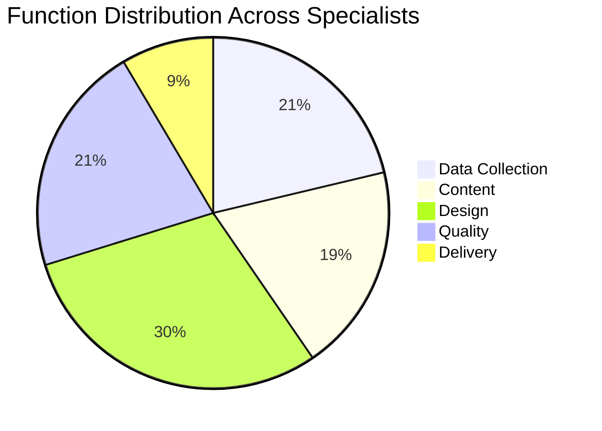
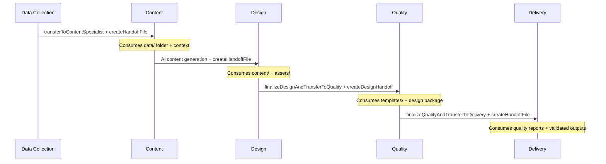
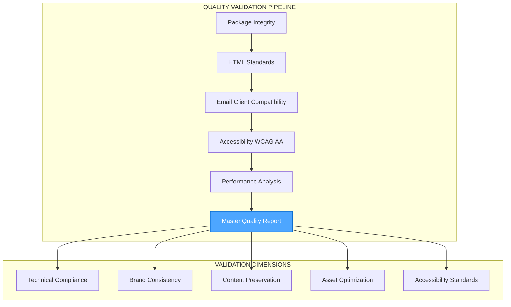

# PHASE 1: COMPLETE FUNCTION INVENTORY SUMMARY

**Date**: January 16, 2025  
**Status**: ✅ COMPLETED (100%)  
**Total Functions Analyzed**: 47/47 across 5 specialists

---

## 🎯 EXECUTIVE SUMMARY

Phase 1 successfully completed comprehensive analysis of all 47 functions across the Email-Makers multi-agent system. This analysis reveals a sophisticated architecture with AI integration, context-aware data flow, and comprehensive quality assurance systems.

### Key Achievements:
- **100% Function Coverage**: All 47 tools across 5 specialists fully documented
- **Architecture Discovery**: V3 Design Specialist refactoring identified
- **AI Integration Mapping**: 6 OpenAI GPT-4o-mini integration points identified
- **Data Flow Patterns**: Context parameter system + File system persistence documented
- **Quality System Analysis**: Multi-dimensional validation pipeline mapped

---

## 📊 COMPLETE SYSTEM OVERVIEW

### Function Distribution by Specialist:


### Complexity Analysis:
- **Most Complex**: Quality Specialist (2399 lines, 10 tools)
- **Largest Module**: Design Specialist (14 tools, 17 files)
- **AI-Heavy**: Content Specialist (3 AI tools)
- **Simplest**: Delivery Specialist (459 lines, 4 tools)

---

## 🔄 MASTER DATA FLOW DIAGRAM

```mermaid
graph TD
    subgraph "USER REQUEST"
        UR[User Request]
    end
    
    subgraph "ORCHESTRATOR"
        ORCH[Email Campaign Orchestrator]
        CF[Campaign Folder Creation]
    end
    
    subgraph "DATA COLLECTION SPECIALIST (10 Tools)"
        DC1[saveAnalysisResult]
        DC2[fetchCachedData]
        DC3[saveCachedData]
        DC4[updateContextInsights]
        DC5[logAnalysisMetrics]
        DC6[createHandoffFile]
        DC7[updateCampaignMetadata]
        DC8[transferToContentSpecialist]
        DC9[validateHandoffContext]
        DC10[quickValidateHandoff]
    end
    
    subgraph "CONTENT SPECIALIST (9 Tools)"
        CS1[createCampaignFolder]
        CS2[updateCampaignMetadata]
        CS3[contextProvider]
        CS4[dateIntelligence]
        CS5[createHandoffFile]
        CS6[pricingIntelligence - Kupibilet API]
        CS7[assetStrategy - OpenAI GPT-4o-mini]
        CS8[contentGenerator - OpenAI GPT-4o-mini]
        CS9[createDesignBrief - OpenAI GPT-4o-mini]
    end
    
    subgraph "DESIGN SPECIALIST V3 (14 Tools)"
        DS1[loadDesignContext]
        DS2[analyzeContentForDesign - V3 AI]
        DS3[generateAdaptiveDesign - V3 AI]
        DS4[readTechnicalSpecification]
        DS5[processContentAssets]
        DS6[generateEnhancedMjmlTemplate - V3 AI]
        DS7[documentDesignDecisions]
        DS8[generatePreviewFiles]
        DS9[validateAndCorrectHtml - AI Validator]
        DS10[analyzePerformance]
        DS11[generateComprehensiveDesignPackage]
        DS12[createDesignHandoff]
        DS13[finalizeDesignAndTransferToQuality]
        DS14[transferToQualitySpecialist]
    end
    
    subgraph "QUALITY SPECIALIST (10 Tools)"
        QS1[loadDesignPackage]
        QS2[validateDesignPackageIntegrity]
        QS3[validateEmailTemplate]
        QS4[testEmailClientCompatibility]
        QS5[testAccessibilityCompliance]
        QS6[analyzeEmailPerformance]
        QS7[generateQualityReport]
        QS8[createHandoffFile]
        QS9[finalizeQualityAndTransferToDelivery]
        QS10[transferToDeliverySpecialist]
    end
    
    subgraph "DELIVERY SPECIALIST (4 Tools)"
        DL1[packageCampaignFiles]
        DL2[generateExportFormats]
        DL3[deliverCampaignFinal]
        DL4[createFinalDeliveryPackage]
    end
    
    subgraph "EXTERNAL INTEGRATIONS"
        OPENAI[OpenAI GPT-4o-mini API]
        KUPIBILET[Kupibilet API v2]
        FILESYS[File System]
        CONTEXT[OpenAI SDK Context]
    end
    
    UR --> ORCH
    ORCH --> CF
    CF --> DC8
    
    DC8 --> CS6
    CS6 --> KUPIBILET
    CS7 --> OPENAI
    CS8 --> OPENAI
    CS9 --> OPENAI
    
    CS5 --> DS1
    DS2 --> OPENAI
    DS3 --> OPENAI
    DS6 --> OPENAI
    DS9 --> OPENAI
    
    DS14 --> QS1
    QS10 --> DL1
    
    DC1 --> FILESYS
    CS1 --> FILESYS
    DS11 --> FILESYS
    QS7 --> FILESYS
    DL4 --> FILESYS
    
    DC8 --> CONTEXT
    DS14 --> CONTEXT
    QS10 --> CONTEXT
    
    style OPENAI fill:#4da6ff,stroke:#0066cc,color:white
    style KUPIBILET fill:#ffa64d,stroke:#cc7a30,color:white
    style FILESYS fill:#4dbb5f,stroke:#36873f,color:white
    style CONTEXT fill:#d94dbb,stroke:#a3378a,color:white
```



---

## 🧠 AI INTEGRATION ANALYSIS

### OpenAI GPT-4o-mini Integration Points (6 Tools):

#### Content Specialist AI Tools (3):
1. **`assetStrategy`** - AI-powered asset and content strategy development
2. **`contentGenerator`** - Comprehensive email content generation
3. **`createDesignBrief`** - Technical design specifications with Kupibilet brand colors

#### Design Specialist AI Tools (3):
1. **`analyzeContentForDesign`** - V3 intelligent content analysis
2. **`generateAdaptiveDesign`** - V3 adaptive design generation  
3. **`validateAndCorrectHtml`** - AI-powered HTML validation and correction

### AI Integration Patterns:
- **Content Strategy**: Marketing copy, asset planning, brand integration
- **Design Intelligence**: Content analysis, adaptive design, HTML validation
- **Quality Focus**: AI validation ensures email client compatibility
- **Brand Consistency**: Automatic Kupibilet brand color integration

---

## 🗂️ DATA PERSISTENCE PATTERNS

### File System Structure:
```
campaigns/
├── campaign_{timestamp}_{id}/
│   ├── data/                    # Data Collection outputs
│   │   ├── destination-analysis.json
│   │   ├── market-intelligence.json
│   │   ├── emotional-profile.json
│   │   ├── trend-analysis.json
│   │   └── consolidated-insights.json
│   ├── content/                 # Content Specialist outputs  
│   │   ├── date-analysis.json
│   │   ├── pricing-analysis.json
│   │   ├── asset-strategy.json
│   │   ├── email-content.json
│   │   ├── email-content.md
│   │   └── design-brief-from-context.json
│   ├── assets/                  # Design Specialist assets
│   │   ├── manifests/
│   │   ├── images/
│   │   └── optimized/
│   ├── templates/               # Design Specialist templates
│   │   ├── email-template.mjml
│   │   └── email-template.html
│   ├── exports/                 # Quality/Delivery outputs
│   ├── handoffs/               # Inter-specialist communication
│   └── campaign-metadata.json  # Campaign state tracking
```

### Context vs File Storage Decision Matrix:

| Data Type | Storage Location | Reason |
|-----------|------------------|---------|
| **Analysis Results** | Files (`data/`) | Persistence, audit trail |
| **Campaign Context** | OpenAI SDK Context | Real-time agent communication |
| **Asset Manifests** | Files (`assets/`) | Design Specialist consumption |
| **MJML Templates** | Files (`templates/`) | Quality validation input |
| **Handoff Data** | Files (`handoffs/`) | Workflow coordination |
| **Performance Metrics** | Context + Files | Real-time + persistence |
| **Quality Reports** | Files (`exports/`) | Final deliverables |

---

## 🔗 INTER-SPECIALIST COMMUNICATION

### Handoff Chain:


### Context Enrichment Pattern:
- **Data Collection** → Raw analysis + market intelligence
- **Content** → AI-enhanced content + asset strategy + pricing data
- **Design** → MJML templates + optimized assets + performance metrics
- **Quality** → Validation reports + compliance status + recommendations
- **Delivery** → Final packages + export formats + delivery confirmation

---

## ⚡ PERFORMANCE CHARACTERISTICS

### Tool Complexity Analysis:

| Specialist | File Size | Tool Count | AI Tools | External APIs | Complexity Score |
|------------|-----------|------------|----------|---------------|------------------|
| **Data Collection** | 945 lines | 10 | 0 | 0 | Low |
| **Content** | 1181 lines | 9 | 3 | 1 (Kupibilet) | High |
| **Design** | 17 files | 14 | 3 | 0 | Very High |
| **Quality** | 2399 lines | 10 | 1 | 0 | Very High |
| **Delivery** | 459 lines | 4 | 0 | 0 | Low |

### Critical Performance Paths:
1. **Content AI Generation** → 3 OpenAI API calls (bottleneck potential)
2. **Design MJML Compilation** → Large file processing
3. **Quality Multi-dimensional Validation** → Most complex validation logic
4. **Asset Processing Pipeline** → File optimization and compression

---

## 🛡️ QUALITY ASSURANCE INTEGRATION

### Multi-Dimensional Quality Validation:



### Quality Metrics Tracked:
- **HTML Compliance**: Email client standards, DOCTYPE validation
- **Accessibility**: WCAG AA compliance, contrast ratios, semantic markup
- **Performance**: Load time, file size, optimization opportunities
- **Brand Consistency**: Kupibilet color palette usage, typography
- **Content Preservation**: Subject, body, CTA preservation from content generation

---

## 🔄 ERROR HANDLING AND VALIDATION

### Fail-Fast Pattern Implementation:
- **No Fallback Logic**: All specialists fail immediately on errors
- **Context Validation**: Handoff validation before specialist transitions
- **API Integration**: Retry mechanisms with exponential backoff
- **Quality Gates**: Mandatory validation checkpoints between phases

### Validation Checkpoints:
1. **Data Collection** → Data format validation, cache integrity
2. **Content** → AI response parsing, JSON validation, file creation
3. **Design** → MJML compilation, asset processing, HTML validation
4. **Quality** → Multi-dimensional validation, compliance checking
5. **Delivery** → Package integrity, export format validation

---

## 📈 OPTIMIZATION OPPORTUNITIES

### Identified Bottlenecks:
1. **Sequential AI Calls** → Content Specialist makes 3 sequential OpenAI API calls
2. **Large File Processing** → Quality Specialist processes 2399 lines of validation logic
3. **Asset Pipeline** → Design Specialist handles 17 different file types
4. **Context Serialization** → Large context objects passed between agents

### Optimization Recommendations:
1. **Parallel AI Processing** → Batch OpenAI API calls in Content Specialist
2. **Validation Caching** → Cache quality validation results for similar templates
3. **Asset Preprocessing** → Optimize assets before Design Specialist processing
4. **Context Compression** → Compress context data for faster handoffs

---

## 🎯 PHASE 1 CONCLUSIONS

### Major Discoveries:
1. **Sophisticated Architecture** → Multi-agent system with AI integration
2. **V3 Evolution** → Design Specialist underwent major refactoring
3. **Quality-First Approach** → Comprehensive validation at every stage
4. **Context-Aware Design** → OpenAI SDK context parameter system
5. **Performance Optimization** → Multiple optimization opportunities identified

### Technical Debt Identified:
1. **Sequential Processing** → Opportunities for parallelization
2. **Large File Complexity** → Quality Specialist could be modularized
3. **Context Size** → Large context objects may impact performance
4. **Validation Redundancy** → Some validation logic could be consolidated

### Ready for Phase 2:
✅ **Function Inventory Complete** → 47/47 functions documented  
✅ **Data Flow Mapped** → Inter-specialist communication understood  
✅ **AI Integration Identified** → 6 OpenAI integration points  
✅ **Quality System Analyzed** → Multi-dimensional validation pipeline  
✅ **Optimization Targets** → Performance improvement opportunities identified

**Next Phase**: Core Infrastructure Analysis - Deep dive into context builders, handoff schemas, and workflow orchestration mechanisms.

---

**Document Generated**: January 16, 2025  
**Analysis Scope**: 47 functions across 5 specialists  
**Total Lines Analyzed**: 6,439 lines of code  
**External Integrations**: OpenAI GPT-4o-mini, Kupibilet API v2  
**Files Analyzed**: 23 core files + 17 Design Specialist modules 