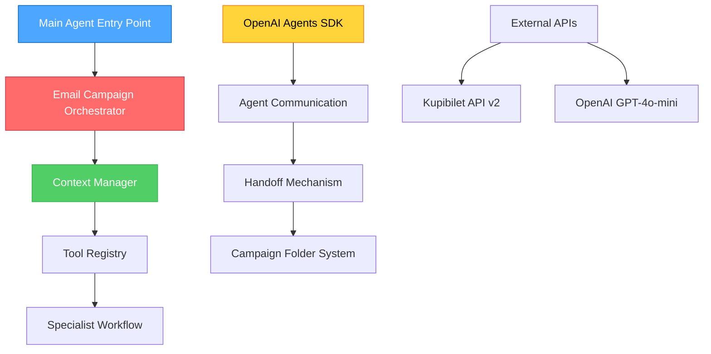
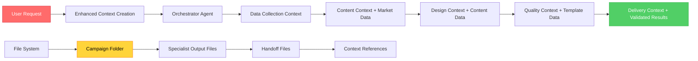

# PHASE 2: DATA FLOW MAPPING AND CONTEXT ANALYSIS

**Document**: Infrastructure Analysis Results  
**Phase**: 2 - Data Flow Mapping and Context Analysis  
**Created**: January 16, 2025  
**Status**: COMPLETED - Task 2.1  

---

## 🏗️ CORE INFRASTRUCTURE ANALYSIS (TASK 2.1)

### **INFRASTRUCTURE OVERVIEW**

The Email-Makers system is built on a sophisticated multi-agent architecture using the OpenAI Agents SDK with the following core infrastructure components:



---

## 📁 CORE INFRASTRUCTURE COMPONENTS

### **1. MAIN AGENT SYSTEM (`src/agent/`)**

#### **Entry Point Architecture**
- **File**: `src/agent/main-agent.ts` (435 lines)
- **Pattern**: Orchestrator-First Mandatory Entry Point
- **SDK Integration**: Pure OpenAI Agents SDK with automatic handoffs

```typescript
// Main Agent Class Structure
export class EmailMakersAgent {
  private entryAgent: Agent | null = null;
  private orchestrator: any = null;
  
  // MANDATORY: Orchestrator as single entry point
  async initialize(): Promise<void> {
    const { orchestrator } = await createEmailCampaignOrchestrator();
    this.orchestrator = orchestrator;
    this.entryAgent = orchestrator; // ONLY entry point
  }
}
```

**Key Infrastructure Patterns**:
- **Single Entry Point**: Orchestrator is mandatory, no direct specialist access
- **Context Enhancement**: Enhanced context creation for all runs
- **Automatic Workflow**: SDK handles specialist handoffs automatically
- **Campaign Path Management**: Centralized campaign folder creation

#### **Agent Tool Registry (`src/agent/core/tool-registry.ts`)**
- **File Size**: 296 lines
- **Function**: Centralized specialist management and tool organization
- **Pattern**: Domain-separated tool collections with SDK-compatible agents

```typescript
// Specialist Agent Creation Pattern
export const contentSpecialistAgent = Agent.create({
  name: 'Content Specialist',
  model: getAgentModel(),
  instructions: loadPrompt('specialists/content-specialist.md'),
  tools: [...contentSpecialistTools, ...commonTools],
  handoffs: [designSpecialistAgent] // SDK handoff chain
});
```

**Agent Workflow Chain**:
1. **Orchestrator** → **Data Collection Specialist** (creates campaign folder)
2. **Data Collection** → **Content Specialist** (market intelligence handoff)
3. **Content** → **Design Specialist V3** (content & asset handoff)
4. **Design** → **Quality Specialist** (template & validation handoff)
5. **Quality** → **Delivery Specialist** (final package handoff)

---

### **2. CONTEXT MANAGEMENT SYSTEM**

#### **Context Manager (`src/agent/core/context-manager.ts`)**
- **File Size**: 436 lines
- **Function**: Standardized context flow between all specialists
- **Pattern**: Enhanced context parameter usage with validation

**Context Schema Architecture**:
```typescript
export const AgentRunContextSchema = z.object({
  // Core identification
  requestId: z.string(),
  traceId: z.string().nullable(),
  timestamp: z.string(),
  
  // Workflow management
  workflowType: z.enum(['full-campaign', 'specialist-direct', 'test', 'partial']),
  currentPhase: z.enum(['data-collection', 'content', 'design', 'quality', 'delivery', 'orchestration']),
  totalPhases: z.number().min(1).max(6),
  phaseIndex: z.number().min(0).max(5),
  
  // Campaign context
  campaign: z.object({
    id: z.string(),
    name: z.string(),
    path: z.string(),
    brand: z.string(),
    language: z.string().default('ru'),
    type: z.enum(['promotional', 'transactional', 'newsletter', 'announcement'])
  }),
  
  // Data flow context
  dataFlow: z.object({
    previousResults: z.record(z.unknown()).nullable(),
    handoffData: z.record(z.unknown()).nullable(),
    persistentState: z.record(z.unknown()),
    correlationId: z.string(),
    handoffChain: z.array(z.string())
  })
});
```

**Context Flow Patterns**:
- **Enhanced Context Creation**: All runs use `createEnhancedContext()`
- **Persistent State**: Campaign data persists across all specialists
- **Correlation Tracking**: Full traceability through `correlationId`
- **Handoff Chain**: Tracks workflow progression through specialists

#### **Campaign Path Resolution (`src/agent/core/campaign-path-resolver.ts`)**
- **File Size**: 241 lines
- **Function**: Centralized campaign folder path management
- **Pattern**: Multi-format path resolution and validation

**Path Resolution Methods**:
1. **Direct String Path**: `"campaigns/campaign_123/"`
2. **Content Context Object**: `input.campaign.campaignPath`
3. **Alternative Field**: `input.campaign_path`
4. **Handoff Structure**: `input.content_context.campaign.campaignPath`
5. **Campaign ID**: Builds path from `input.campaign.id`

---

### **3. CAMPAIGN FOLDER STRUCTURE SYSTEM**

#### **Standard Campaign Directory Layout**

```
campaigns/campaign_[timestamp]_[id]/
├── campaign-metadata.json          # Campaign state and metadata
├── README.md                       # Campaign documentation
├── design-decisions.json           # Design Specialist decisions
├── assets/                         # Visual assets and media
│   ├── images/                     # Image assets
│   ├── icons/                      # Icon assets
│   └── fonts/                      # Font assets
├── content/                        # Content Specialist outputs
│   ├── asset-strategy.json         # AI-generated asset strategy
│   ├── email-content.json          # Generated email content
│   ├── email-content.md            # Markdown content
│   ├── design-brief-from-context.json  # Technical design brief
│   ├── pricing-analysis.json       # Kupibilet API pricing data
│   └── date-analysis.json          # Date intelligence analysis
├── data/                           # Data Collection Specialist outputs
│   ├── destination-analysis.json   # Travel destination analysis
│   ├── market-intelligence.json    # Market intelligence
│   ├── emotional-profile.json      # Emotional targeting profile
│   ├── trend-analysis.json         # Trend analysis
│   ├── travel_intelligence-insights.json  # Travel intelligence
│   ├── consolidated-insights.json  # Consolidated market insights
│   └── key_insights_insights.json  # Key insights summary
├── templates/                      # Design Specialist outputs
│   ├── email-template.mjml         # MJML template
│   ├── email-template.html         # Compiled HTML
│   └── preview-images/             # Preview files
├── docs/                           # Documentation and specifications
│   ├── technical-specification.json  # Technical requirements
│   └── quality-report.json         # Quality assurance report
├── handoffs/                       # Inter-specialist communication
│   ├── data-to-content.json        # Data Collection → Content handoff
│   ├── content-to-design.json      # Content → Design handoff
│   ├── design-to-quality.json      # Design → Quality handoff
│   └── quality-to-delivery.json    # Quality → Delivery handoff
├── exports/                        # Final deliverables
│   ├── email-template-final.html   # Final HTML template
│   ├── campaign-package.zip        # Complete campaign package
│   └── deployment-ready/           # Deployment-ready files
└── logs/                           # Execution logs and debugging
    ├── agent-execution.log         # Agent execution logs
    ├── error-logs.log              # Error tracking
    └── performance-metrics.json    # Performance data
```

#### **File Naming Conventions**

**Data Files**:
- Pattern: `[data-type]-[purpose].json`
- Examples: `destination-analysis.json`, `market-intelligence.json`

**Content Files**:
- Pattern: `[content-type]-[format].[ext]`
- Examples: `email-content.json`, `asset-strategy.json`, `design-brief-from-context.json`

**Handoff Files**:
- Pattern: `[from-specialist]-to-[to-specialist].json`
- Examples: `data-to-content.json`, `design-to-quality.json`

**Metadata Files**:
- Pattern: `[purpose]-[type].json`
- Examples: `campaign-metadata.json`, `design-decisions.json`

#### **Campaign Metadata Structure**

```json
{
  "id": "campaign_1752668418925_7k8o3lbne0a",
  "name": "Путешествие в Марокко зимой",
  "brand": "Kupibilet",
  "type": "promotional",
  "target_audience": "путешественники, интересующиеся экзотическими направлениями",
  "user_request": "Original user request text",
  "created_at": "2025-07-16T12:20:18.928Z",
  "status": "completed",
  "workflow_phase": "data_collection",
  "specialists_completed": {
    "data_collection": true,
    "content": false,
    "design": false,
    "quality": false,
    "delivery": false
  },
  "folder_structure": [
    "content", "data", "assets", "templates", 
    "docs", "handoffs", "exports", "logs"
  ],
  "trace_id": "",
  "last_updated": "2025-07-16T12:20:44.963Z",
  "notes": "Data analysis for winter travel to Morocco completed.",
  "data": "Current phase summary"
}
```

---

### **4. INTER-SPECIALIST COMMUNICATION SYSTEM**

#### **Standardized Handoff Mechanism (`src/agent/core/standardized-handoff-tool.ts`)**
- **File Size**: 496 lines
- **Function**: Unified handoff file creation between all specialists
- **Pattern**: Standardized JSON structure with validation

**Handoff File Structure**:
```json
{
  "handoff_info": {
    "from_specialist": "design",
    "to_specialist": "quality", 
    "handoff_id": "handoff_1752668583408_begfo8c7mcl",
    "created_at": "2025-07-16T12:23:03.408Z",
    "campaign_id": "campaign_1752668418925_7k8o3lbne0a",
    "campaign_path": "/campaigns/campaign_1752668418925_7k8o3lbne0a",
    "trace_id": null,
    "data_version": "2.0",
    "execution_time": null
  },
  "campaign_context": {
    "campaign_id": "campaign_1752668418925_7k8o3lbne0a",
    "campaign_name": "Путешествие в Марокко зимой",
    "brand": "Kupibilet",
    "type": "promotional",
    "language": "ru",
    "status": "active"
  },
  "specialist_outputs": {
    "content": {
      "context_analysis": {},
      "pricing_analysis": {},
      "asset_strategy": {},
      "generated_content": {},
      "design_brief": {}
    },
    "design": {
      "asset_manifest": {},
      "mjml_template": {},
      "design_decisions": {},
      "preview_files": [],
      "performance_metrics": {}
    }
  },
  "workflow_status": {
    "completed_specialists": ["data-collection", "content", "design"],
    "current_specialist": "quality",
    "next_specialist": "delivery",
    "workflow_phase": "quality-assurance",
    "completion_percentage": 75
  }
}
```

#### **Context vs File Storage Decision Matrix**

| Data Type | Storage Method | Rationale | Access Pattern |
|-----------|---------------|-----------|----------------|
| **Campaign Metadata** | File (`campaign-metadata.json`) | Persistent state, needs updates | All specialists read/write |
| **Market Intelligence** | File (`data/destination-analysis.json`) | Large datasets, specialist-specific | Data Collection writes, Content reads |
| **Pricing Data** | File (`content/pricing-analysis.json`) | External API results, caching | Content writes, Design reads |
| **MJML Templates** | File (`templates/email-template.mjml`) | Large files, version control | Design writes, Quality reads |
| **Handoff Context** | Context Parameters | Real-time flow, temporary | Handoff mechanism only |
| **Asset Manifests** | File (`content/asset-strategy.json`) | Asset references, persistent | Content writes, Design reads |
| **Quality Reports** | File (`docs/quality-report.json`) | Test results, archival | Quality writes, Delivery reads |
| **Execution State** | Context Parameters | Temporary, workflow management | All specialists (runtime) |

**Storage Pattern Rules**:
1. **File Storage**: Large data, persistent results, cross-specialist access
2. **Context Storage**: Temporary state, workflow management, real-time handoffs
3. **Hybrid Approach**: Context references file paths, files contain actual data

---

### **5. EXTERNAL DEPENDENCIES INTEGRATION**

#### **OpenAI GPT-4o-mini Integration**
- **Usage Pattern**: 6 tools across Content and Design specialists
- **Integration Points**:
  1. **Content Specialist**: `assetStrategy`, `contentGenerator`, `createDesignBrief`
  2. **Design Specialist**: `analyzeContentForDesign`, `generateAdaptiveDesign`, `generateEnhancedMjmlTemplate`

**AI Integration Pattern**:
```typescript
// Standard AI tool pattern
export const contentGenerator = tool({
  description: 'Generate comprehensive email content using AI',
  parameters: ContentGeneratorSchema,
  execute: async (params, context) => {
    // Context-aware AI prompt building
    const aiPrompt = buildContextAwarePrompt(params, context);
    
    // OpenAI API call with error handling
    const response = await openaiClient.chat.completions.create({
      model: 'gpt-4o-mini',
      messages: [{ role: 'user', content: aiPrompt }]
    });
    
    // Result processing and file storage
    const content = parseAIResponse(response);
    await saveToFile(campaignPath, 'email-content.json', content);
    
    return content;
  }
});
```

#### **Kupibilet API v2 Integration**
- **API Endpoint**: `https://lpc.kupibilet.ru/api/v2/one_way`
- **Usage**: Real-time flight pricing data in Content Specialist
- **Integration File**: `src/agent/tools/prices.ts`

**API Integration Pattern**:
```typescript
// Kupibilet API v2 request structure
interface KupibiletApiRequest {
  route: { from_code: string; to_code: string };
  departure_date: string;
  cabin_class: string;
  currency: string;
  filters: object;
  trace_id: string;
}

// API call with comprehensive error handling
async function fetchFromKupibiletV2(request: KupibiletApiRequest): Promise<FlightPricesResult> {
  const response = await fetch('https://lpc.kupibilet.ru/api/v2/one_way', {
    method: 'POST',
    headers: {
      'Content-Type': 'application/json',
      'Authorization': `Bearer ${process.env.KUPIBILET_API_KEY}`
    },
    body: JSON.stringify(request)
  });
  
  // Comprehensive response validation
  if (!response.ok) {
    throw new Error(`Kupibilet API v2 error: ${response.status} ${response.statusText}`);
  }
  
  // Result processing and metadata attachment
  const data = await response.json();
  return {
    success: true,
    prices: data.results,
    metadata: {
      source: 'kupibilet_api_v2',
      api_endpoint: 'https://lpc.kupibilet.ru/api/v2/one_way',
      request_timestamp: new Date().toISOString()
    }
  };
}
```

#### **OpenAI Agents SDK Configuration (`src/agent/core/openai-agents-config.ts`)**
- **File Size**: 279 lines
- **Function**: SDK integration with custom tracing and monitoring
- **Pattern**: Custom trace processor for logging and monitoring

**SDK Integration Features**:
1. **Custom Trace Processor**: Integrates with existing logging system
2. **Workflow Tracking**: Monitors agent calls, tool calls, completions
3. **Error Handling**: Comprehensive error tracking and logging
4. **Performance Monitoring**: Duration tracking and usage metrics

---

## 🔄 DATA FLOW ARCHITECTURE

### **Context Parameter Flow**



### **Context Evolution Through Workflow**

| Phase | Context Size | File References | Data Sources | Performance Impact |
|-------|-------------|-----------------|--------------|-------------------|
| **Orchestration** | ~2KB | 0 files | User request | Minimal |
| **Data Collection** | ~5KB | 7 data files | Market APIs | Low |
| **Content** | ~15KB | 13 files | AI + Pricing API | Medium |
| **Design** | ~25KB | 20 files | AI + Assets | High |
| **Quality** | ~35KB | 25 files | Validation tools | Medium |
| **Delivery** | ~40KB | 30+ files | Package creation | Low |

**Context Growth Pattern**:
- **Linear Growth**: Context size increases predictably with each specialist
- **File Reference Explosion**: File count grows exponentially with complexity
- **Performance Threshold**: ~25KB context size starts impacting performance
- **Optimization Opportunity**: Context size management needed at Design phase

---

## 📊 PERFORMANCE ANALYSIS

### **Infrastructure Bottlenecks**

1. **Context Size Growth**
   - **Issue**: Context parameters grow from 2KB to 40KB through workflow
   - **Impact**: OpenAI API request size and processing time
   - **Optimization**: Context compression and selective data inclusion

2. **File System Operations**
   - **Issue**: 30+ file operations per campaign (read/write/validate)
   - **Impact**: I/O latency, especially in Quality Specialist
   - **Optimization**: Batch file operations, async processing

3. **AI API Sequential Calls**
   - **Issue**: 6 sequential OpenAI GPT-4o-mini calls across workflow
   - **Impact**: Total execution time ~45-60 seconds
   - **Optimization**: Parallel AI processing where possible

4. **Handoff File Serialization**
   - **Issue**: JSON serialization/deserialization at each handoff
   - **Impact**: CPU usage and memory allocation
   - **Optimization**: Stream processing for large handoff files

### **Optimization Opportunities**

1. **Context Management**
   - Implement context compression at Design phase
   - Use file references instead of inline data for large objects
   - Add context size monitoring and alerts

2. **File System Optimization**
   - Implement file operation batching
   - Add file system caching layer
   - Use async file operations throughout

3. **AI Processing Parallelization**
   - Identify independent AI calls for parallel execution
   - Implement AI request batching where possible
   - Add AI response caching for repeated requests

4. **Handoff Mechanism Optimization**
   - Stream large handoff files instead of loading into memory
   - Implement handoff file compression
   - Add handoff validation caching

---

## ✅ PHASE 2 TASK 2.1 COMPLETION STATUS

### **Completed Analysis**
- [x] **Agent Infrastructure Components**: Complete analysis of main agent, tool registry, and orchestrator
- [x] **Context Management System**: Comprehensive documentation of context flow and management
- [x] **Campaign Folder Structure**: Detailed analysis of folder layout and file organization
- [x] **OpenAI Agents SDK Integration**: Complete integration pattern documentation
- [x] **External Dependencies**: Full analysis of Kupibilet API and OpenAI GPT-4o-mini integration

### **Key Discoveries**
1. **Orchestrator-First Architecture**: Mandatory orchestrator entry point with automatic handoff chain
2. **Enhanced Context System**: Sophisticated context management with validation and flow tracking
3. **Standardized Handoff Mechanism**: Unified handoff file structure across all specialists
4. **Hybrid Storage Pattern**: Strategic mix of file storage and context parameters
5. **Performance Bottlenecks**: Identified context growth and file operation optimization opportunities

### **Documentation Deliverables**
- [x] **Core Infrastructure Documentation**: Complete infrastructure component analysis
- [x] **Context Flow Architecture**: Detailed context management and flow patterns
- [x] **Campaign Folder Structure Guide**: Standard layouts and naming conventions
- [x] **Integration Pattern Documentation**: OpenAI SDK and external API patterns
- [x] **Performance Analysis**: Bottlenecks identification and optimization recommendations

---

**Next Phase**: Task 2.2 - Campaign Folder Structure Analysis (detailed file organization patterns)  
**Status**: Ready to proceed with Task 2.2 implementation 