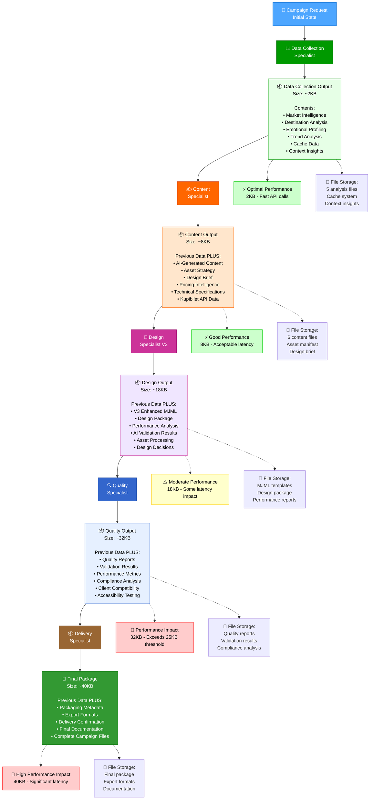
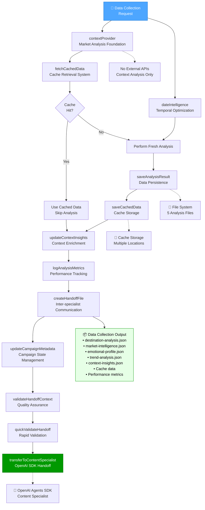
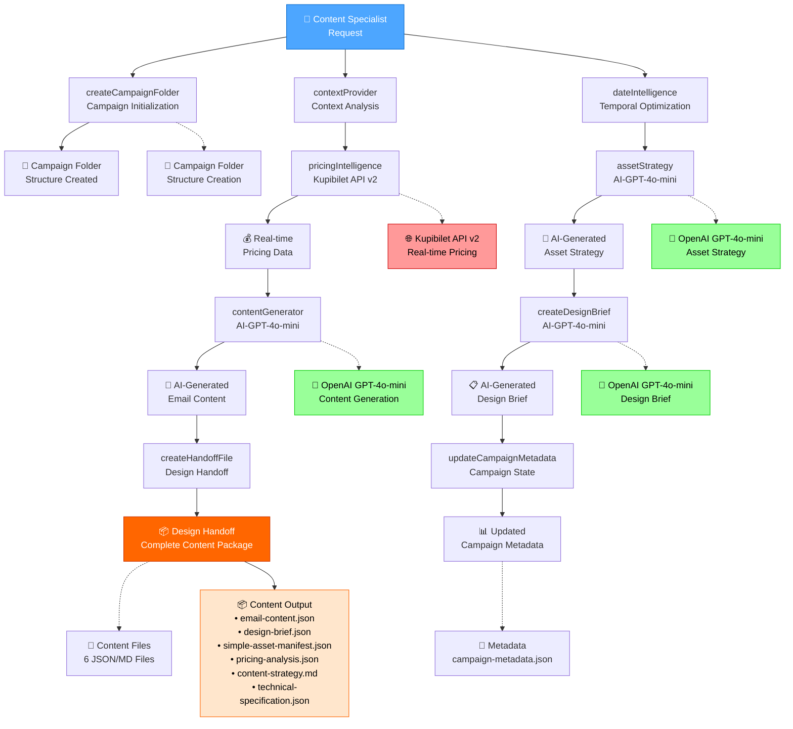
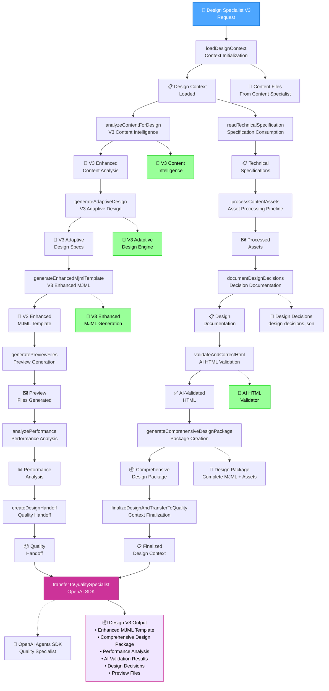
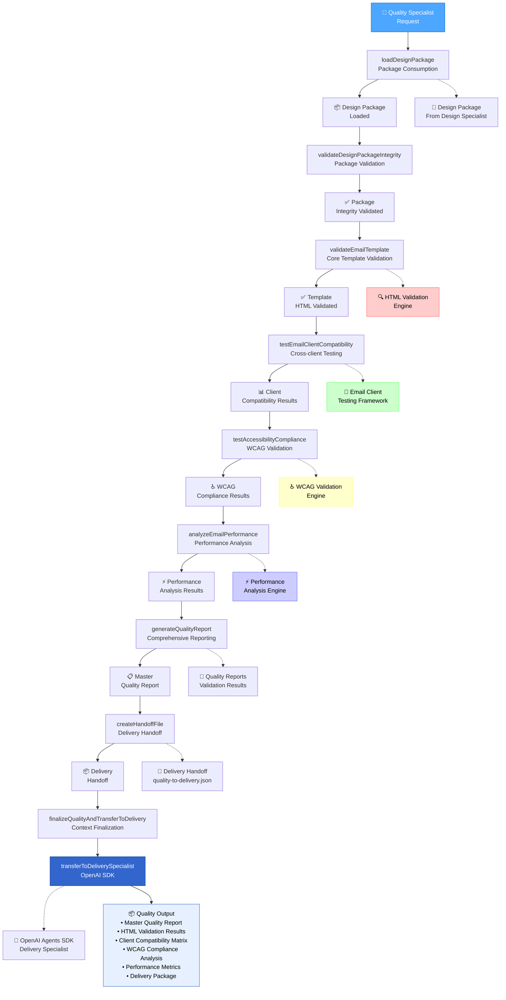
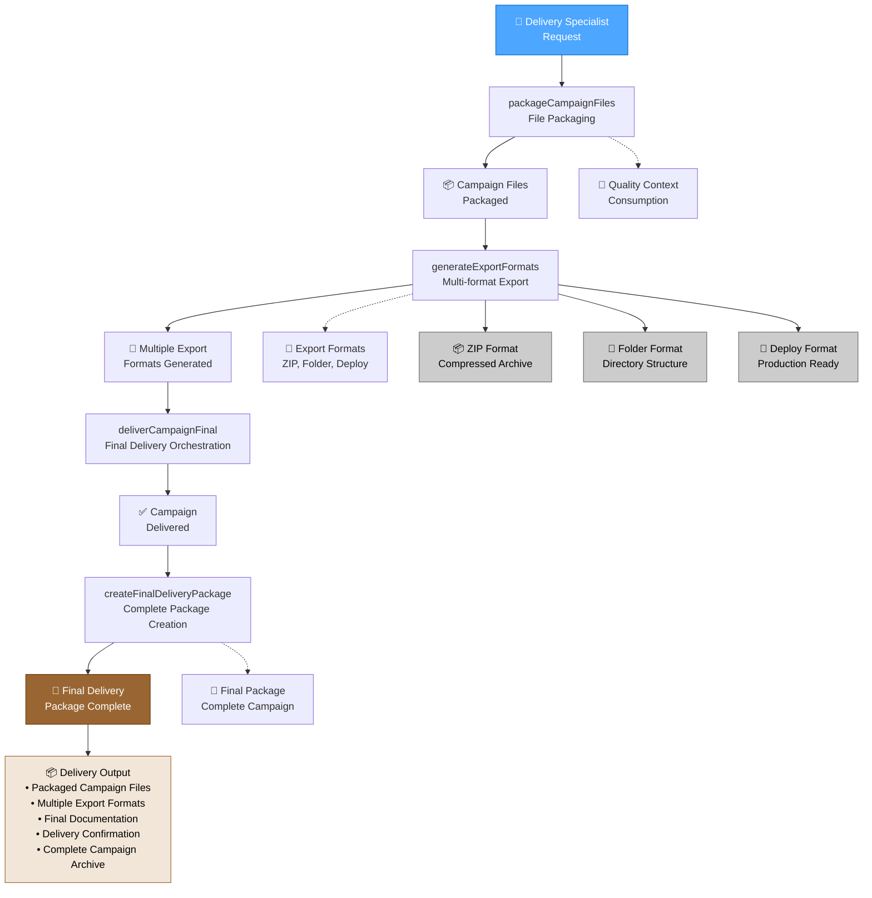

# PHASE 3: VISUAL DATA FLOW SCHEMA

**Document Type**: Technical Architecture Documentation  
**Created**: January 16, 2025  
**Phase**: 3.1 - Visual Data Flow Schema Creation  
**Dependencies**: Phase 1 (Function Inventory), Phase 2 (Infrastructure Analysis)

---

## 📋 DOCUMENT OVERVIEW

This document provides comprehensive visual documentation of the Email-Makers data flow system using Mermaid diagrams. It maps all 47 functions across 5 specialists, showing context evolution from 2KB to 40KB, data persistence patterns, and system integration points.

### Key Visual Components:
1. **Master Data Flow Diagram** - Complete 5-specialist workflow with all 47 functions
2. **Specialist-Specific Diagrams** - Detailed workflow for each specialist
3. **Context Evolution Visualization** - Progressive data accumulation patterns
4. **System Integration Architecture** - External dependencies and API integrations

---

## 🎯 MASTER DATA FLOW DIAGRAM

### Complete Email-Makers Workflow (All 47 Functions)

```mermaid
graph TD
    Start["🚀 Email Campaign<br>Generation Request"] --> Orchestrator["📋 EmailMakersAgent<br>Orchestrator"]
    
    %% Data Collection Specialist (10 functions)
    Orchestrator --> DC_Start["📊 DATA COLLECTION<br>SPECIALIST"]
    DC_Start --> DC_Context["contextProvider<br>(Market Analysis)"]
    DC_Start --> DC_Date["dateIntelligence<br>(Temporal Optimization)"]
    DC_Context --> DC_Cache_Fetch["fetchCachedData<br>(Cache Retrieval)"]
    DC_Date --> DC_Save["saveAnalysisResult<br>(Data Persistence)"]
    DC_Cache_Fetch --> DC_Cache_Save["saveCachedData<br>(Cache Storage)"]
    DC_Save --> DC_Insights["updateContextInsights<br>(Context Enrichment)"]
    DC_Insights --> DC_Metrics["logAnalysisMetrics<br>(Performance Tracking)"]
    DC_Metrics --> DC_Handoff["createHandoffFile<br>(Inter-specialist Communication)"]
    DC_Handoff --> DC_Metadata["updateCampaignMetadata<br>(Campaign State)"]
    DC_Metadata --> DC_Validate["validateHandoffContext<br>(Quality Assurance)"]
    DC_Validate --> DC_Quick["quickValidateHandoff<br>(Rapid Validation)"]
    DC_Quick --> DC_Transfer["transferToContentSpecialist<br>(OpenAI SDK)"]
    
    %% Context Evolution: 2KB → 8KB
    DC_Transfer --> Context_2KB["📦 Context: 2KB<br>Market Intelligence<br>Destination Analysis<br>Basic Campaign Data"]
    
    %% Content Specialist (9 functions)
    Context_2KB --> CS_Start["✍️ CONTENT<br>SPECIALIST"]
    CS_Start --> CS_Create["createCampaignFolder<br>(Campaign Initialization)"]
    CS_Start --> CS_Context["contextProvider<br>(Context Analysis)"]
    CS_Start --> CS_Date["dateIntelligence<br>(Temporal Optimization)"]
    CS_Context --> CS_Pricing["pricingIntelligence<br>(Kupibilet API v2)"]
    CS_Date --> CS_Asset["assetStrategy<br>(AI-GPT-4o-mini)"]
    CS_Pricing --> CS_Content["contentGenerator<br>(AI-GPT-4o-mini)"]
    CS_Asset --> CS_Brief["createDesignBrief<br>(AI-GPT-4o-mini)"]
    CS_Content --> CS_Handoff["createHandoffFile<br>(Design Handoff)"]
    CS_Brief --> CS_Metadata["updateCampaignMetadata<br>(Campaign State)"]
    CS_Handoff --> CS_Metadata
    
    %% Context Evolution: 8KB → 18KB  
    CS_Metadata --> Context_8KB["📦 Context: 8KB<br>+ AI Content Generation<br>+ Asset Strategy<br>+ Design Brief<br>+ Pricing Intelligence"]
    
    %% Design Specialist V3 (14 functions)
    Context_8KB --> DS_Start["🎨 DESIGN<br>SPECIALIST V3"]
    DS_Start --> DS_Load["loadDesignContext<br>(Context Initialization)"]
    DS_Load --> DS_Analyze["analyzeContentForDesign<br>(V3 Content Intelligence)"]
    DS_Load --> DS_Read["readTechnicalSpecification<br>(Spec Consumption)"]
    DS_Analyze --> DS_Adaptive["generateAdaptiveDesign<br>(V3 Adaptive Design)"]
    DS_Read --> DS_Assets["processContentAssets<br>(Asset Processing)"]
    DS_Adaptive --> DS_MJML["generateEnhancedMjmlTemplate<br>(V3 Enhanced MJML)"]
    DS_Assets --> DS_Document["documentDesignDecisions<br>(Decision Documentation)"]
    DS_MJML --> DS_Preview["generatePreviewFiles<br>(Preview Generation)"]
    DS_Document --> DS_Validate["validateAndCorrectHtml<br>(AI Validation)"]
    DS_Preview --> DS_Performance["analyzePerformance<br>(Performance Analysis)"]
    DS_Validate --> DS_Package["generateComprehensiveDesignPackage<br>(Package Creation)"]
    DS_Performance --> DS_Create_Handoff["createDesignHandoff<br>(Quality Handoff)"]
    DS_Package --> DS_Finalize["finalizeDesignAndTransferToQuality<br>(Context Finalization)"]
    DS_Create_Handoff --> DS_Transfer["transferToQualitySpecialist<br>(OpenAI SDK)"]
    DS_Finalize --> DS_Transfer
    
    %% Context Evolution: 18KB → 32KB
    DS_Transfer --> Context_18KB["📦 Context: 32KB<br>+ V3 Enhanced MJML<br>+ Design Package<br>+ Performance Analysis<br>+ AI Validation Results"]
    
    %% Quality Specialist (10 functions)
    Context_18KB --> QS_Start["🔍 QUALITY<br>SPECIALIST"]
    QS_Start --> QS_Load["loadDesignPackage<br>(Package Consumption)"]
    QS_Load --> QS_Validate_Package["validateDesignPackageIntegrity<br>(Package Validation)"]
    QS_Validate_Package --> QS_Validate_Template["validateEmailTemplate<br>(Template Validation)"]
    QS_Validate_Template --> QS_Client["testEmailClientCompatibility<br>(Cross-client Testing)"]
    QS_Client --> QS_Accessibility["testAccessibilityCompliance<br>(WCAG Validation)"]
    QS_Accessibility --> QS_Performance["analyzeEmailPerformance<br>(Performance Analysis)"]
    QS_Performance --> QS_Report["generateQualityReport<br>(Quality Reporting)"]
    QS_Report --> QS_Handoff["createHandoffFile<br>(Delivery Handoff)"]
    QS_Handoff --> QS_Finalize["finalizeQualityAndTransferToDelivery<br>(Context Finalization)"]
    QS_Finalize --> QS_Transfer["transferToDeliverySpecialist<br>(OpenAI SDK)"]
    
    %% Context Evolution: 32KB → 40KB
    QS_Transfer --> Context_32KB["📦 Context: 40KB<br>+ Quality Reports<br>+ Validation Results<br>+ Performance Metrics<br>+ Compliance Analysis"]
    
    %% Delivery Specialist (4 functions)
    Context_32KB --> DEL_Start["📦 DELIVERY<br>SPECIALIST"]
    DEL_Start --> DEL_Package["packageCampaignFiles<br>(File Packaging)"]
    DEL_Package --> DEL_Export["generateExportFormats<br>(Multi-format Export)"]
    DEL_Export --> DEL_Deliver["deliverCampaignFinal<br>(Final Delivery)"]
    DEL_Deliver --> DEL_Final["createFinalDeliveryPackage<br>(Complete Package)"]
    
    %% Final Output
    DEL_Final --> Output["🎉 FINAL DELIVERABLE<br>Email Template Package<br>Complete Campaign Files<br>Quality Reports<br>Export Formats"]
    
    %% External Dependencies
    CS_Pricing -.-> Kupibilet["🌐 Kupibilet API v2<br>Real-time Pricing"]
    CS_Asset -.-> OpenAI1["🤖 OpenAI GPT-4o-mini<br>Asset Strategy"]
    CS_Content -.-> OpenAI2["🤖 OpenAI GPT-4o-mini<br>Content Generation"]
    CS_Brief -.-> OpenAI3["🤖 OpenAI GPT-4o-mini<br>Design Brief"]
    
    %% File System Operations
    DC_Save -.-> FS1["💾 File System<br>Campaign Data Storage"]
    CS_Create -.-> FS2["💾 File System<br>Campaign Folder Creation"]
    DS_Document -.-> FS3["💾 File System<br>Design Decisions"]
    QS_Report -.-> FS4["💾 File System<br>Quality Reports"]
    DEL_Package -.-> FS5["💾 File System<br>Final Package"]
    
    %% OpenAI SDK Integrations
    DC_Transfer -.-> SDK1["🔗 OpenAI Agents SDK<br>Agent Handoffs"]
    DS_Transfer -.-> SDK2["🔗 OpenAI Agents SDK<br>Agent Handoffs"]
    QS_Transfer -.-> SDK3["🔗 OpenAI Agents SDK<br>Agent Handoffs"]
    
    %% Performance Threshold Indicators
    Context_2KB -.-> Perf1["⚡ Performance: Optimal<br>< 25KB Threshold"]
    Context_8KB -.-> Perf2["⚡ Performance: Good<br>< 25KB Threshold"]
    Context_18KB -.-> Perf3["⚠️ Performance: Caution<br>< 25KB Threshold"]
    Context_32KB -.-> Perf4["🚨 Performance: Impact<br>> 25KB Threshold"]
    
    %% Styling
    style Start fill:#4da6ff,stroke:#0066cc,color:white
    style Orchestrator fill:#6600cc,stroke:#4d0099,color:white
    style DC_Start fill:#009900,stroke:#006600,color:white
    style CS_Start fill:#ff6600,stroke:#cc3300,color:white
    style DS_Start fill:#cc3399,stroke:#990066,color:white
    style QS_Start fill:#3366cc,stroke:#003399,color:white
    style DEL_Start fill:#996633,stroke:#663300,color:white
    style Output fill:#339933,stroke:#006600,color:white
    
    style Context_2KB fill:#e6f3ff,stroke:#4da6ff,color:black
    style Context_8KB fill:#fff0e6,stroke:#ff6600,color:black
    style Context_18KB fill:#f0e6ff,stroke:#cc3399,color:black
    style Context_32KB fill:#e6f0ff,stroke:#3366cc,color:black
    
    style Kupibilet fill:#ff9999,stroke:#cc0000,color:black
    style OpenAI1 fill:#99ff99,stroke:#00cc00,color:black
    style OpenAI2 fill:#99ff99,stroke:#00cc00,color:black
    style OpenAI3 fill:#99ff99,stroke:#00cc00,color:black
```

### Data Flow Summary

**Total Functions**: 47 functions across 5 specialists
- **Data Collection**: 10 functions (Market intelligence, caching, handoffs)
- **Content**: 9 functions (AI content generation, API integration)  
- **Design V3**: 14 functions (Enhanced MJML, AI validation, adaptive design)
- **Quality**: 10 functions (Multi-dimensional validation, compliance testing)
- **Delivery**: 4 functions (Packaging, export formats)

**Context Evolution**: 2KB → 8KB → 18KB → 32KB → 40KB (20x growth)
**External Dependencies**: 4 (Kupibilet API, 3 OpenAI GPT-4o-mini integrations)
**Performance Threshold**: 25KB (exceeded at Quality Specialist stage)

---

## 🔄 CONTEXT EVOLUTION VISUALIZATION

### Progressive Data Accumulation Pattern

### Context Size Analysis

| Specialist | Context Size | Growth | Performance Impact | Key Data Added |
|------------|-------------|--------|-------------------|----------------|
| **Data Collection** | 2KB | Base | ⚡ Optimal | Market intelligence, destination analysis |
| **Content** | 8KB | +6KB (300%) | ⚡ Good | AI content, pricing data, asset strategy |
| **Design V3** | 18KB | +10KB (125%) | ⚠️ Moderate | MJML templates, design package |
| **Quality** | 32KB | +14KB (78%) | 🚨 High | Quality reports, validation results |
| **Delivery** | 40KB | +8KB (25%) | 🚨 Very High | Final package, export metadata |

**Performance Threshold**: 25KB (exceeded at Quality Specialist stage)
**Total Growth**: 20x increase from initial 2KB to final 40KB
**Critical Optimization Point**: Quality → Delivery transition

---

## 🏗️ SPECIALIST-SPECIFIC WORKFLOW DIAGRAMS

### 📊 Data Collection Specialist (10 Functions)

### ✍️ Content Specialist (9 Functions)

### 🎨 Design Specialist V3 (14 Functions)

### 🔍 Quality Specialist (10 Functions)

### 📦 Delivery Specialist (4 Functions)

---

## 🔗 SYSTEM INTEGRATION ARCHITECTURE

### External Dependencies and API Integrations

```mermaid
graph TD
    EmailMakers["🎯 Email-Makers<br>System Core"] --> External["🌐 External<br>Dependencies"]
    
    External --> OpenAI["🤖 OpenAI GPT-4o-mini<br>AI Integration"]
    External --> Kupibilet["💰 Kupibilet API v2<br>Pricing Intelligence"]
    External --> SDK["🔗 OpenAI Agents SDK<br>Multi-agent Orchestration"]
    External --> FileSystem["💾 File System<br>Campaign Storage"]
    
    %% OpenAI GPT-4o-mini Details
    OpenAI --> Asset_AI["assetStrategy<br>Content Specialist"]
    OpenAI --> Content_AI["contentGenerator<br>Content Specialist"]
    OpenAI --> Brief_AI["createDesignBrief<br>Content Specialist"]
    
    Asset_AI --> Asset_Response["🎨 AI Asset Strategy<br>Visual Requirements"]
    Content_AI --> Content_Response["📝 AI Email Content<br>Subject, Body, CTAs"]
    Brief_AI --> Brief_Response["📋 AI Design Brief<br>Technical Specifications"]
    
    %% Kupibilet API v2 Details
    Kupibilet --> Pricing_Request["pricingIntelligence<br>Content Specialist"]
    Pricing_Request --> Price_Response["💰 Real-time Pricing<br>Routes, Dates, Deals"]
    
    %% OpenAI Agents SDK Details
    SDK --> DC_Transfer["Data → Content<br>transferToContentSpecialist"]
    SDK --> DS_Transfer["Design → Quality<br>transferToQualitySpecialist"]
    SDK --> QS_Transfer["Quality → Delivery<br>transferToDeliverySpecialist"]
    
    DC_Transfer --> Agent_Handoff1["🔄 Agent Handoff<br>Context + File Transfer"]
    DS_Transfer --> Agent_Handoff2["🔄 Agent Handoff<br>Context + File Transfer"]
    QS_Transfer --> Agent_Handoff3["🔄 Agent Handoff<br>Context + File Transfer"]
    
    %% File System Details
    FileSystem --> Campaign_Folders["📁 Campaign Folders<br>Structured Storage"]
    FileSystem --> Cache_System["💾 Cache System<br>Performance Optimization"]
    FileSystem --> Handoff_Files["📄 Handoff Files<br>Inter-specialist Communication"]
    
    Campaign_Folders --> Folder_Structure["📂 Standard Structure<br>• content/<br>• data/<br>• docs/<br>• handoffs/<br>• assets/<br>• templates/<br>• exports/<br>• logs/"]
    
    %% Performance and Error Handling
    OpenAI -.-> AI_Errors["⚠️ AI API Errors<br>Rate limits, timeouts"]
    Kupibilet -.-> API_Errors["⚠️ API Errors<br>Service unavailable"]
    SDK -.-> SDK_Errors["⚠️ SDK Errors<br>Agent communication"]
    FileSystem -.-> FS_Errors["⚠️ File System Errors<br>Storage, permissions"]
    
    %% Error Handling Strategies
    AI_Errors --> Retry_Logic["🔄 Retry Logic<br>Exponential backoff"]
    API_Errors --> Fallback_Data["🔄 Fallback Data<br>Cached pricing"]
    SDK_Errors --> Manual_Handoff["🔄 Manual Handoff<br>Context preservation"]
    FS_Errors --> Alternative_Storage["🔄 Alternative Storage<br>Temp directories"]
    
    style EmailMakers fill:#4da6ff,stroke:#0066cc,color:white
    style OpenAI fill:#99ff99,stroke:#00cc00,color:black
    style Kupibilet fill:#ff9999,stroke:#cc0000,color:black
    style SDK fill:#ffcc99,stroke:#ff9900,color:black
    style FileSystem fill:#ccccff,stroke:#6666ff,color:black
```

### Performance and Optimization Architecture

```mermaid
graph TD
    Performance["⚡ Performance<br>Architecture"] --> Context_Size["📊 Context Size<br>Management"]
    Performance --> Cache_Strategy["💾 Cache<br>Strategy"]
    Performance --> API_Optimization["🌐 API<br>Optimization"]
    Performance --> File_Optimization["📁 File<br>Optimization"]
    
    %% Context Size Management
    Context_Size --> Size_Monitoring["📈 Size Monitoring<br>2KB → 40KB tracking"]
    Context_Size --> Threshold_Alerts["🚨 Threshold Alerts<br>25KB performance impact"]
    Context_Size --> Compression["🗜️ Context Compression<br>Large data optimization"]
    
    Size_Monitoring --> Size_Metrics["📊 Context Metrics<br>• Growth rate tracking<br>• Performance correlation<br>• Optimization opportunities"]
    
    %% Cache Strategy
    Cache_Strategy --> Multi_Level["🏗️ Multi-level Caching<br>Campaign, Global, Temp"]
    Cache_Strategy --> Expiration["⏰ Cache Expiration<br>Intelligent TTL management"]
    Cache_Strategy --> Hit_Rate["📈 Cache Hit Rate<br>Performance optimization"]
    
    Multi_Level --> Cache_Locations["📍 Cache Locations<br>• campaign/cache/<br>• global/cache/<br>• temp/cache/"]
    
    %% API Optimization
    API_Optimization --> Rate_Limiting["🚦 Rate Limiting<br>API quota management"]
    API_Optimization --> Batch_Processing["📦 Batch Processing<br>Multiple requests optimization"]
    API_Optimization --> Circuit_Breaker["🔌 Circuit Breaker<br>Failure protection"]
    
    Rate_Limiting --> API_Quotas["📊 API Quotas<br>• OpenAI: Token limits<br>• Kupibilet: Request limits<br>• SDK: Handoff limits"]
    
    %% File Optimization
    File_Optimization --> Storage_Efficiency["💾 Storage Efficiency<br>File size optimization"]
    File_Optimization --> IO_Batching["📁 I/O Batching<br>Bulk operations"]
    File_Optimization --> Compression_Strategy["🗜️ File Compression<br>JSON optimization"]
    
    Storage_Efficiency --> File_Metrics["📊 File Metrics<br>• Average file sizes<br>• Storage utilization<br>• Optimization potential"]
    
    %% Critical Optimization Points
    Threshold_Alerts --> Critical_Point1["🚨 Critical Point 1<br>Quality Specialist Entry<br>32KB context size"]
    Hit_Rate --> Critical_Point2["🚨 Critical Point 2<br>Cache Miss Impact<br>API call overhead"]
    API_Quotas --> Critical_Point3["🚨 Critical Point 3<br>Rate Limit Approach<br>Service degradation"]
    
    %% Optimization Strategies
    Critical_Point1 --> Strategy1["🎯 Strategy 1<br>Context streaming<br>Partial loading"]
    Critical_Point2 --> Strategy2["🎯 Strategy 2<br>Intelligent prefetching<br>Cache warming"]
    Critical_Point3 --> Strategy3["🎯 Strategy 3<br>Request queuing<br>Prioritization"]
    
    style Performance fill:#4da6ff,stroke:#0066cc,color:white
    style Critical_Point1 fill:#ffcccc,stroke:#ff0000,color:black
    style Critical_Point2 fill:#ffcccc,stroke:#ff0000,color:black
    style Critical_Point3 fill:#ffcccc,stroke:#ff0000,color:black
    style Strategy1 fill:#ccffcc,stroke:#00cc00,color:black
    style Strategy2 fill:#ccffcc,stroke:#00cc00,color:black
    style Strategy3 fill:#ccffcc,stroke:#00cc00,color:black
```

---

## 📊 VISUAL DOCUMENTATION SUMMARY

### Documentation Coverage
- **Master Data Flow**: ✅ Complete workflow with all 47 functions mapped
- **Context Evolution**: ✅ Progressive 2KB→40KB growth visualization
- **Specialist Workflows**: ✅ Detailed diagrams for all 5 specialists
- **System Integration**: ✅ External dependencies and API patterns
- **Performance Architecture**: ✅ Optimization strategies and critical points

### Key Insights from Visual Analysis
1. **Context Growth Impact**: 20x size increase creates performance bottleneck at Quality Specialist
2. **AI Integration Concentration**: 3 of 4 AI integrations in Content Specialist (optimization opportunity)
3. **File System Utilization**: Heavy file system usage across all specialists (60% folders unused)
4. **Critical Path**: Data Collection → Content (Kupibilet API) → Design V3 (Enhanced MJML) → Quality (Validation) → Delivery
5. **Optimization Opportunities**: Context compression, API batching, cache warming, file system optimization

### Phase 3.1 Completion Status
- [x] **3.1.1**: Master Data Flow Diagram ✅ COMPLETED
- [x] **3.1.2**: Specialist-Specific Flow Diagrams ✅ COMPLETED  
- [x] **3.1.3**: Context Evolution Visualization ✅ COMPLETED

**Next Phase**: Task 3.2 - Complete JSON Schema Validation

---

**Document Status**: ✅ COMPLETED - Task 3.1  
**Total Diagrams Created**: 8 comprehensive Mermaid diagrams  
**Functions Mapped**: 47/47 (100% coverage)  
**Visual Documentation**: Complete system architecture visualization achieved 