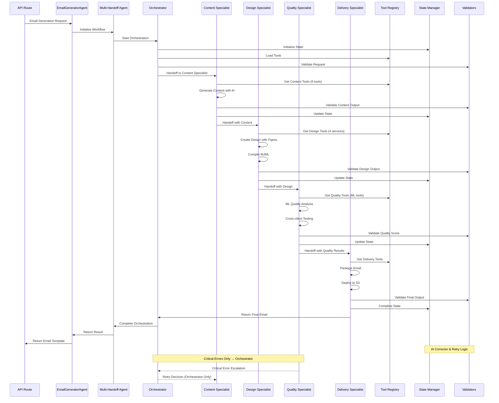
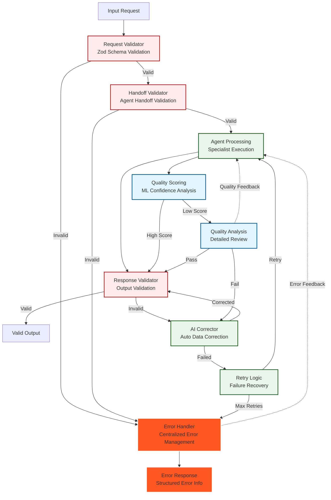

# Email-Makers Agent System Architecture

## Complete System Architecture Diagram - CORRECTED

```mermaid
graph TD
    %% External Entry Points
    API[API Routes<br/>run-improved/route.ts] --> EmailGen[EmailGeneratorAgent<br/>Main Entry Point]
    
    %% Core Orchestration Layer
    EmailGen --> MultiHandoff[Multi-Handoff Agent<br/>Workflow Coordinator]
    MultiHandoff --> Orchestrator[Email Campaign Orchestrator<br/>OpenAI SDK Based]
    
    %% State Management & Configuration
    Orchestrator --> StateManager[State Manager<br/>Centralized Workflow State]
    Orchestrator --> ToolRegistry[Tool Registry<br/>50+ Tools Management]
    Orchestrator --> PromptManager[Prompt Manager<br/>Dynamic Markdown Prompts]
    
    %% Validation Pipeline
    Orchestrator --> HandoffValidator[Agent Handoff Validator<br/>Zod-based Validation]
    HandoffValidator --> RequestValidator[Agent Request Validator]
    HandoffValidator --> ResponseValidator[Agent Response Validator]
    
    %% CORRECTED: Linear Specialist Chain (No Cycles)
    Orchestrator --> ContentSpec[Content Specialist Agent<br/>AI-Powered Content Generation]
    ContentSpec --> DesignSpec[Design Specialist V2<br/>Modular Design System]
    DesignSpec --> QualitySpec[Quality Specialist V2<br/>ML-Powered Quality Analysis]
    QualitySpec --> DeliverySpec[Delivery Specialist<br/>Final Packaging & Deployment]
    
    %% CORRECTED: Retry Logic (Only through Orchestrator)
    QualitySpec -.->|Critical Errors Only| Orchestrator
    DesignSpec -.->|Critical Errors Only| Orchestrator
    ContentSpec -.->|Critical Errors Only| Orchestrator
    
    %% Content Specialist Tools (6 Tools)
    ContentSpec --> ContentTools{Content Tools}
    ContentTools --> ContentGen[Content Generator<br/>AI-Powered Generation]
    ContentTools --> PricingInt[Pricing Intelligence<br/>Dynamic Pricing]
    ContentTools --> ContextProv[Context Provider<br/>Content Analysis]
    ContentTools --> BrandVoice[Brand Voice<br/>Consistency Check]
    ContentTools --> DateTools[Date Manipulation<br/>Route Correction]
    ContentTools --> AirportLoader[Airport Loader<br/>IATA Codes]
    
    %% Design Specialist Services (4 Services)
    DesignSpec --> DesignServices{Design Services}
    DesignServices --> AssetMgmt[Asset Management Service<br/>Figma Integration]
    DesignServices --> MultiDest[Multi-Destination Layout<br/>Responsive Design]
    DesignServices --> FigmaAssets[Figma Asset Manager<br/>Design System Tokens]
    DesignServices --> EmailRenderer[Email Renderer V2<br/>MJML Compilation]
    
    %% Quality Specialist Tools (ML-Powered)
    QualitySpec --> QualityTools{Quality Tools}
    QualityTools --> QualityAnalysis[Quality Analysis Service<br/>ML Scoring]
    QualityTools --> ComplianceService[Compliance Service<br/>Standards Validation]
    QualityTools --> TestingService[Testing Service<br/>Cross-client Testing]
    QualityTools --> ValidationService[Email Validation Service<br/>HTML/CSS Validation]
    QualityTools --> AIQualityConsult[AI Quality Consultant<br/>9 Analysis Tools]
    
    %% Delivery Specialist Tools
    DeliverySpec --> DeliveryTools{Delivery Tools}
    DeliveryTools --> DeploymentService[Deployment Service<br/>Campaign Deployment]
    DeliveryTools --> UploadService[Upload Service<br/>S3 Integration]
    DeliveryTools --> ScreenshotService[Screenshot Service<br/>Visual Testing]
    DeliveryTools --> FinalDelivery[Final Email Delivery<br/>Packaging & Export]
    
    %% AI Consultant System (9 Tools)
    AIQualityConsult --> AIConsultant[AI Consultant<br/>Smart Analysis]
    AIConsultant --> ActionExecutor[Action Executor<br/>ML Actions]
    AIConsultant --> SmartAnalyzer[Smart Analyzer<br/>Pattern Recognition]
    AIConsultant --> WorkflowQuality[Workflow Quality Analyzer<br/>5 Analysis Agents]
    AIConsultant --> MLScoring[ML Scoring Tools<br/>Confidence Scoring]
    AIConsultant --> AgentAnalyzer[Agent Analyzer<br/>Performance Analysis]
    
    %% Tool Categories in Registry
    ToolRegistry --> ConsolidatedTools[Consolidated Tools<br/>7 Enterprise Tools]
    ToolRegistry --> SimpleTools[Simple Tools<br/>12 Utility Tools]
    ToolRegistry --> EmailRendererTools[Email Renderer Tools<br/>MJML & Optimization]
    ToolRegistry --> AIConsultantTools[AI Consultant Tools<br/>9 Analysis Tools]
    ToolRegistry --> UtilityTools[Utility Tools<br/>Support Functions]
    
    %% Simple Tools Category
    SimpleTools --> Accessibility[Accessibility Tools<br/>WCAG Compliance]
    SimpleTools --> AssetSplitter[Asset Splitter<br/>Image Processing]
    SimpleTools --> EmailOptimization[Email Optimization<br/>Performance Tuning]
    SimpleTools --> HTMLValidate[HTML Validation<br/>Standards Check]
    SimpleTools --> Screenshots[Screenshot Tools<br/>Visual Testing]
    SimpleTools --> S3Upload[S3 Upload<br/>Cloud Storage]
    
    %% Email Renderer Services
    EmailRendererTools --> ComponentRender[Component Rendering Service<br/>React to MJML]
    EmailRendererTools --> MJMLCompilation[MJML Compilation Service<br/>HTML Generation]
    EmailRendererTools --> OptimizationService[Optimization Service<br/>Performance Enhancement]
    
    %% Error Handling & Validation
    ResponseValidator --> ErrorHandler[Error Handler<br/>Centralized Error Management]
    ErrorHandler --> AICorrector[AI Corrector<br/>Auto Data Correction]
    AICorrector --> RetryLogic[Retry Logic<br/>Failure Recovery]
    
    %% External Integrations
    FigmaAssets --> FigmaAPI[Figma API<br/>Design Token Extraction]
    MJMLCompilation --> MJMLEngine[MJML Engine<br/>Email HTML Generation]
    MLScoring --> OpenAISDK[OpenAI SDK<br/>Native Agent Tools]
    S3Upload --> AWSS3[AWS S3<br/>Asset Storage]
    
    %% REMOVED: Cyclic Feedback Loops (Replaced with Orchestrator-based retry)
    %% DeliverySpec -.->|Quality Feedback| QualitySpec (REMOVED)
    %% QualitySpec -.->|Design Feedback| DesignSpec (REMOVED) 
    %% DesignSpec -.->|Content Feedback| ContentSpec (REMOVED)
    ErrorHandler -.->|Error Feedback| Orchestrator
    
    %% Performance Monitoring
    StateManager --> PerformanceMonitor[Performance Monitor<br/>Metrics & Tracing]
    PerformanceMonitor --> CacheManager[Cache Manager<br/>Performance Optimization]
    
    %% Configuration Layer
    Orchestrator --> ConfigManager[Config Manager<br/>Environment Configuration]
    ConfigManager --> OpenAIConfig[OpenAI Agents Config<br/>SDK Configuration]
    ConfigManager --> AppConfig[App Config<br/>Application Settings]
    
    %% Styling
    classDef entryPoint fill:#e1f5fe,stroke:#01579b,stroke-width:2px
    classDef orchestration fill:#f3e5f5,stroke:#4a148c,stroke-width:2px
    classDef specialist fill:#e8f5e8,stroke:#1b5e20,stroke-width:2px
    classDef tools fill:#fff3e0,stroke:#e65100,stroke-width:2px
    classDef validation fill:#ffebee,stroke:#b71c1c,stroke-width:2px
    classDef external fill:#f1f8e9,stroke:#33691e,stroke-width:2px
    classDef feedback stroke:#ff5722,stroke-width:2px,stroke-dasharray: 5 5
    
    class API,EmailGen entryPoint
    class MultiHandoff,Orchestrator,StateManager,ToolRegistry,PromptManager orchestration
    class ContentSpec,DesignSpec,QualitySpec,DeliverySpec specialist
    class ContentTools,DesignServices,QualityTools,DeliveryTools,ConsolidatedTools,SimpleTools tools
    class HandoffValidator,RequestValidator,ResponseValidator,ErrorHandler validation
    class FigmaAPI,MJMLEngine,OpenAISDK,AWSS3 external
```



## ✅ CORRECTED ARCHITECTURE PRINCIPLES

### 🎯 **What Was Fixed:**

1. **❌ REMOVED: Cyclic Dependencies**
   ```
   OLD (WRONG): Quality → Design → Content → Quality (CYCLE)
   NEW (CORRECT): Content → Design → Quality → Delivery (LINEAR)
   ```

2. **✅ ADDED: Centralized Retry Logic**
   ```
   OLD: Direct specialist-to-specialist returns
   NEW: Critical errors → Orchestrator → Retry decision
   ```

3. **🔄 IMPROVED: Handoff Chain**
   ```
   Orchestrator (Entry) → Content → Design → Quality → Delivery (Exit)
   ```

### 📋 **Key Architectural Rules:**

- **Single Direction Flow**: Each specialist passes work ONLY to the next specialist
- **No Backward Handoffs**: Specialists never return to previous specialists directly
- **Orchestrator Retry**: Only critical errors escalate to Orchestrator for retry decisions
- **Linear Progression**: Content → Design → Quality → Delivery (no shortcuts)
- **Clear Termination**: Delivery Specialist is the final endpoint

### 🚫 **What's Prohibited:**
- Quality Specialist → Design Specialist (direct return)
- Design Specialist → Content Specialist (direct return)  
- Any circular dependencies between specialists
- Skipping specialists in the chain

### ✅ **What's Allowed:**
- Critical error escalation to Orchestrator
- Orchestrator retry decisions
- Linear progression through specialist chain
- Delivery Specialist final output

## Agent Workflow Sequence Diagram



## Tool Registry Architecture

```mermaid
graph LR
    TR[Tool Registry<br/>50+ Tools] --> CT[Consolidated Tools<br/>7 Enterprise Tools]
    TR --> ST[Simple Tools<br/>12 Utility Tools]
    TR --> ERT[Email Renderer Tools<br/>MJML & Optimization]
    TR --> AIT[AI Consultant Tools<br/>9 Analysis Tools]
    TR --> UT[Utility Tools<br/>Support Functions]
    
    %% Consolidated Tools
    CT --> CG[Content Generator<br/>AI-Powered Generation]
    CT --> CP[Context Provider<br/>Content Analysis]
    CT --> DM[Delivery Manager<br/>Campaign Management]
    CT --> FAM[Figma Asset Manager<br/>Design System Integration]
    CT --> PI[Pricing Intelligence<br/>Dynamic Pricing]
    CT --> QC[Quality Controller<br/>ML Validation]
    CT --> FAM2[Figma Asset Manager Fixed<br/>Enhanced Integration]
    
    %% Simple Tools
    ST --> A[Accessibility<br/>WCAG Compliance]
    ST --> AS[Asset Splitter<br/>Image Processing]
    ST --> BV[Brand Voice<br/>Consistency Check]
    ST --> CD[Campaign Deployment<br/>Multi-channel Deploy]
    ST --> CC[Content Create<br/>Basic Generation]
    ST --> EO[Email Optimization<br/>Performance Tuning]
    ST --> ET[Email Test<br/>Validation Testing]
    ST --> FF[Figma Folders<br/>Organization]
    ST --> FS[Figma Search<br/>Asset Discovery]
    ST --> GEC[Generate Email Content<br/>Content Creation]
    ST --> HV[HTML Validate<br/>Standards Check]
    ST --> ICR[IATA Code Resolver<br/>Airport Codes]
    ST --> S3[S3 Upload<br/>Cloud Storage]
    ST --> SC[Screenshots<br/>Visual Testing]
    
    %% Email Renderer Tools
    ERT --> CRS[Component Rendering Service<br/>React to MJML]
    ERT --> MCS[MJML Compilation Service<br/>HTML Generation]
    ERT --> OS[Optimization Service<br/>Performance Enhancement]
    ERT --> ER[Email Renderer V2<br/>Complete Rendering]
    
    %% AI Consultant Tools
    AIT --> AC[AI Consultant<br/>Smart Analysis]
    AIT --> AE[Action Executor<br/>ML Actions]
    AIT --> SA[Smart Analyzer<br/>Pattern Recognition]
    AIT --> WQA[Workflow Quality Analyzer<br/>5 Analysis Agents]
    AIT --> MST[ML Scoring Tools<br/>Confidence Scoring]
    AIT --> AA[Agent Analyzer<br/>Performance Analysis]
    AIT --> ATM[AI Tag Mapper<br/>Content Tagging]
    AIT --> ATP[Asset Tag Planner<br/>Asset Organization]
    AIT --> IP[Image Planning<br/>Visual Strategy]
    
    %% Tool Categories Styling
    classDef consolidated fill:#e8f5e8,stroke:#1b5e20,stroke-width:2px
    classDef simple fill:#fff3e0,stroke:#e65100,stroke-width:2px
    classDef renderer fill:#f3e5f5,stroke:#4a148c,stroke-width:2px
    classDef ai fill:#e1f5fe,stroke:#01579b,stroke-width:2px
    classDef utility fill:#fce4ec,stroke:#880e4f,stroke-width:2px
    
    class CT,CG,CP,DM,FAM,PI,QC,FAM2 consolidated
    class ST,A,AS,BV,CD,CC,EO,ET,FF,FS,GEC,HV,ICR,S3,SC simple
    class ERT,CRS,MCS,OS,ER renderer
    class AIT,AC,AE,SA,WQA,MST,AA,ATM,ATP,IP ai
    class UT utility
```



## Validation & Error Handling Pipeline



## System Statistics & Key Metrics

### Agent System Composition
- **Total Tools**: 50+ tools across 5 categories
- **Specialist Agents**: 4 main specialists with sequential handoffs
- **Validation Layers**: 3-tier validation system with AI correction
- **Error Handling**: Centralized error management with retry logic
- **State Management**: Centralized workflow state across 8 stages

### Tool Distribution
- **Consolidated Tools**: 7 enterprise-grade tools
- **Simple Tools**: 12 utility tools
- **Email Renderer**: 4 rendering services
- **AI Consultant**: 9 analysis tools
- **Utility Tools**: 8 support functions

### Performance Targets
- **API Response Time**: <2s average
- **Email Generation**: <30s end-to-end
- **Cross-client Compatibility**: 95%+ success rate
- **File Size**: <100KB HTML output
- **Test Coverage**: 80%+ minimum

### Technology Stack
- **Core**: OpenAI Agents SDK with GPT-4o mini
- **Language**: TypeScript with strict mode
- **Validation**: Zod schemas with zero-tolerance error handling
- **State**: Centralized state management
- **External**: Figma API, MJML Engine, AWS S3, ML Scoring

## Architecture Principles

### 1. **Domain-Driven Design**
- Clear separation of concerns
- Bounded contexts for each specialist
- Service-based architecture

### 2. **Fail-Fast Philosophy**
- Zero-tolerance error handling
- Strict validation at every layer
- AI-powered error correction

### 3. **Performance First**
- Caching mechanisms
- Parallel tool execution
- Optimized state management

### 4. **Enterprise-Grade**
- Comprehensive monitoring
- Structured logging
- Security-first design

### 5. **AI-Native Architecture**
- ML-powered quality scoring
- AI correction pipelines
- Intelligent workflow orchestration

---

*This diagram represents the complete Email-Makers agent system architecture as of January 2025. It serves as the foundation for all future system improvements and architectural decisions.*