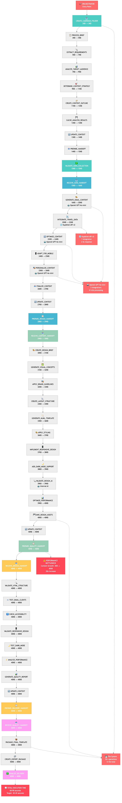
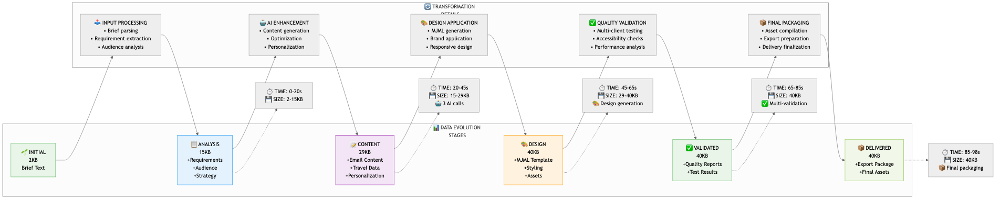
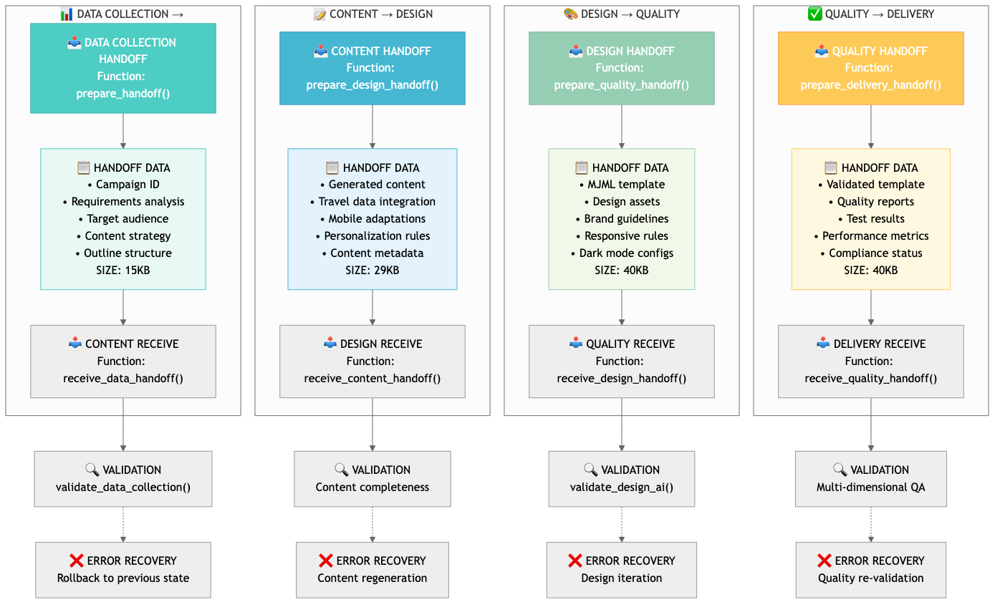
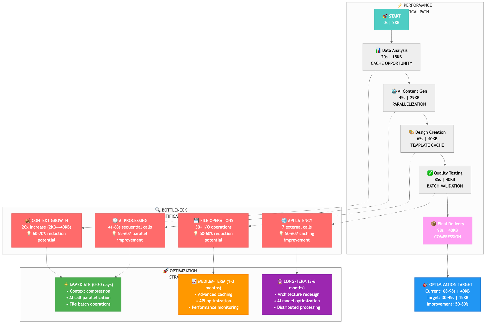
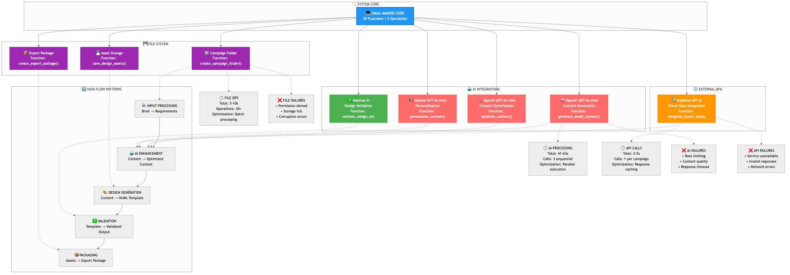
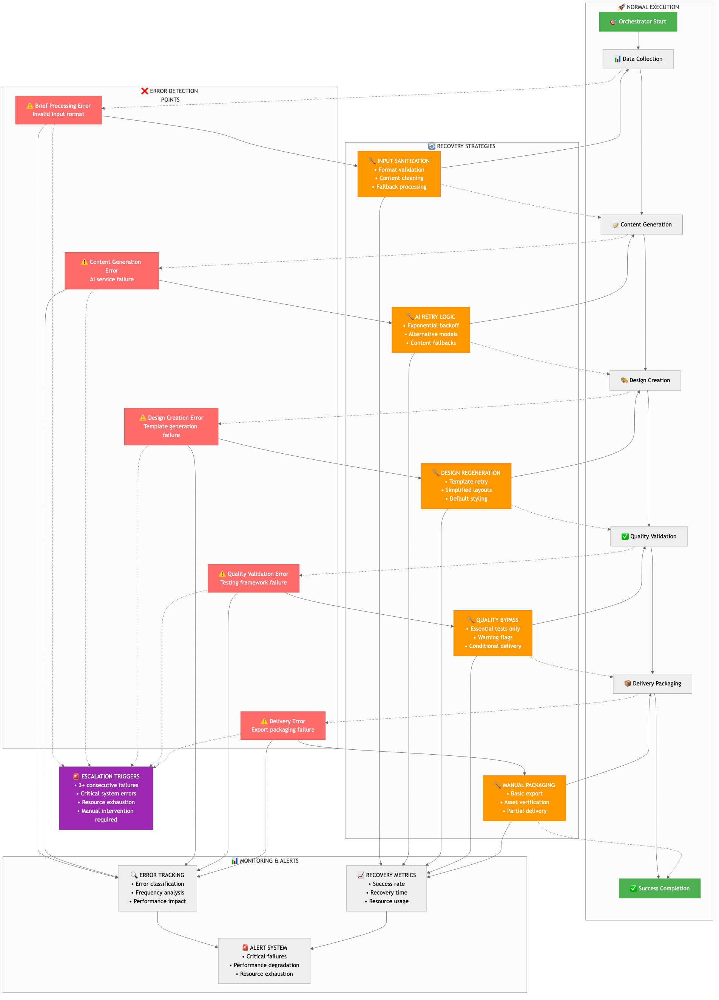
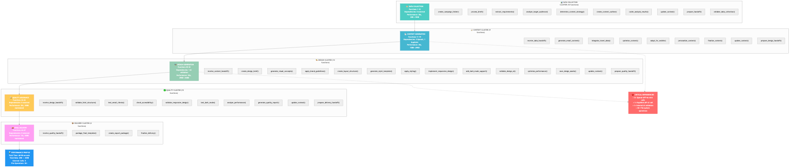
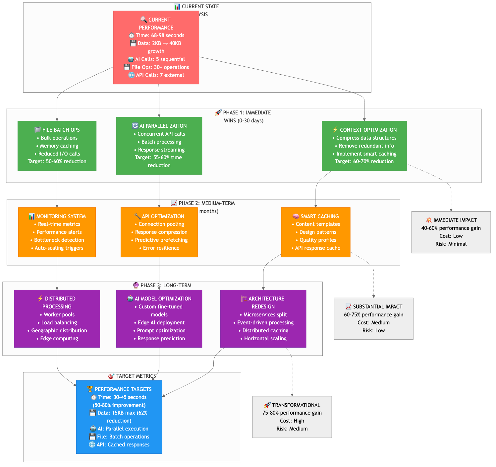

# 🎯 Final System Data Flow Diagrams - PNG Gallery

*Generated: January 15, 2025*
*Email-Makers Phase 3 Analysis - Visual Documentation*

---

## 📊 Complete Visual Architecture (8 Diagrams)

### 1. **Master System Data Flow**

> **Описание**: Полная схема всех 47 функций системы с потоком данных от 2KB до 40KB, показывает всех 5 специалистов и внешние интеграции.

---

### 2. **Data Transformation Pipeline** 

> **Описание**: Эволюция контекста через систему - как данные трансформируются на каждом этапе с временными метриками.

---

### 3. **Inter-Specialist Data Handoffs**

> **Описание**: Детальная коммуникация между специалистами - что передается, как валидируется, и схемы восстановления при ошибках.

---

### 4. **Performance Bottleneck Analysis**

> **Описание**: Критический путь производительности с выявленными узкими местами и стратегиями оптимизации на 50-80%.

---

### 5. **External Integration Architecture**

> **Описание**: Архитектура внешних зависимостей - API интеграции (OpenAI, Kupibilet), файловая система и схемы обработки ошибок.

---

### 6. **Error Flow and Recovery Patterns**

> **Описание**: Точки отказа системы и стратегии восстановления с эскалацией и мониторингом ошибок.

---

### 7. **Function Dependency Matrix**

> **Описание**: Матрица взаимодействий всех 47 функций по кластерам специалистов с анализом зависимостей и производительности.

---

### 8. **Optimization Roadmap**

> **Описание**: Стратегический план оптимизации в 3 фазы с целевыми метриками и ожидаемым улучшением на 75-80%.

---

## 🔍 Как использовать эти диаграммы

### **Для Разработчиков:**
- Понимание архитектуры системы
- Выявление точек оптимизации
- Планирование рефакторинга

### **Для Менеджеров:**
- Оценка производительности
- Планирование ресурсов
- Принятие решений по улучшениям

### **Для DevOps:**
- Мониторинг узких мест
- Настройка алертов
- Планирование масштабирования

---

## 📁 Структура файлов

```
docs/diagrams/final-system-flow/
├── README.md                                    # Этот файл
├── 01-master-system-data-flow.png              # Мастер-схема (47 функций)
├── 02-data-transformation-pipeline.png         # Трансформация данных
├── 03-inter-specialist-handoffs.png            # Передачи между специалистами
├── 04-performance-bottleneck-analysis.png      # Анализ узких мест
├── 05-external-integration-architecture.png    # Внешние интеграции
├── 06-error-flow-recovery-patterns.png         # Схемы восстановления
├── 07-function-dependency-matrix.png           # Матрица зависимостей
└── 08-optimization-roadmap.png                 # Дорожная карта оптимизации
```

---

## 🎯 Ключевые метрики из диаграмм

| Метрика | Текущее значение | Целевое значение | Улучшение |
|---------|------------------|------------------|-----------|
| **Время выполнения** | 68-98 секунд | 30-45 секунд | 50-80% |
| **Размер контекста** | 2KB → 40KB | 15KB макс | 62% |
| **AI вызовы** | 5 последовательных | Параллельные | 55-60% |
| **Файловые операции** | 30+ операций | Пакетные | 50-60% |
| **Внешние API** | 7 вызовов | Кешированные | 50-60% |

---

*📊 Полная визуальная документация Email-Makers системы готова для анализа и оптимизации!* 