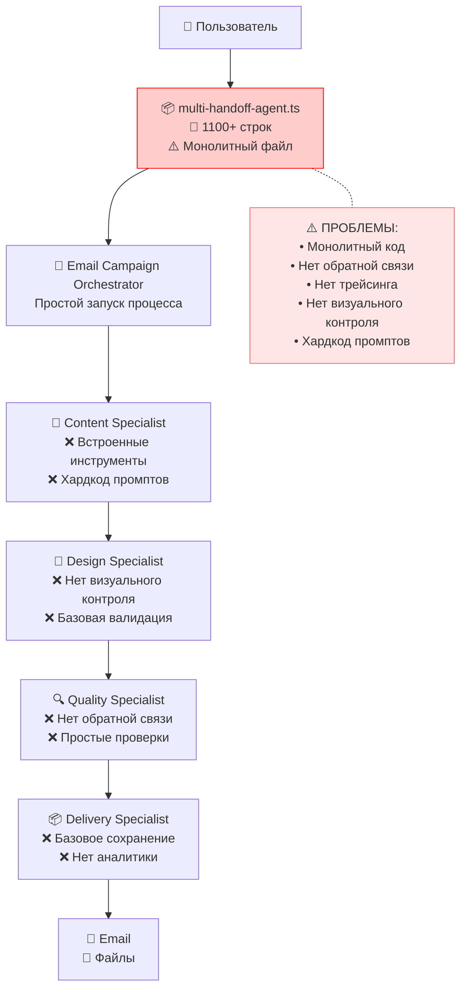
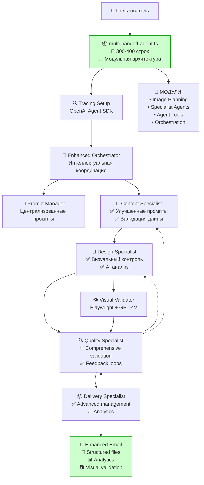
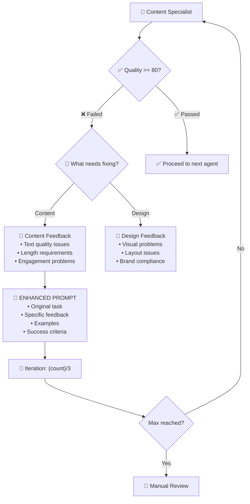

# КОМПЛЕКСНЫЙ ПЛАН УЛУЧШЕНИЯ MULTI-HANDOFF-AGENT.TS

**Версия**: 1.0  
**Дата создания**: January 27, 2025  
**Статус**: 📋 В планировании  

---

## 📊 СХЕМЫ АРХИТЕКТУРЫ

### 🔄 ТЕКУЩЕЕ СОСТОЯНИЕ СИСТЕМЫ



### 🚀 ЦЕЛЕВОЕ СОСТОЯНИЕ СИСТЕМЫ



---

## 🎯 ФАЗЫ РЕАЛИЗАЦИИ

### ФАЗА 1: РЕФАКТОРИНГ АРХИТЕКТУРЫ (2 недели)

#### 1.1 Выделение модулей из multi-handoff-agent.ts

**Цель**: Сократить файл с 1100+ до 300-400 строк

```typescript
// src/agent/modules/image-planning.ts
export interface ImagePlanningConfig {
  topic: string;
  campaign_type: string;
  emotional_tone: string;
}

export async function planEmailImages(config: ImagePlanningConfig) {
  // Логика планирования изображений
}
```

#### 1.2 Создание модульной структуры

```
src/agent/
├── modules/
│   ├── image-planning.ts
│   ├── specialist-agents.ts
│   ├── agent-tools.ts
│   └── orchestration.ts
├── core/
│   ├── tracing-setup.ts
│   ├── feedback-loop.ts
│   ├── prompt-manager.ts
│   └── visual-validator.ts
└── prompts/
    ├── specialists/
    ├── orchestrator/
    ├── tools/
    └── feedback/
```

### ФАЗА 2: СИСТЕМА ПРОМПТОВ (1 неделя)

#### 2.1 PromptManager класс

```typescript
// src/agent/core/prompt-manager.ts
export class PromptManager {
  private cache = new Map<string, string>();
  
  async loadPrompt(category: string, name: string): Promise<string> {
    const key = `${category}/${name}`;
    if (!this.cache.has(key)) {
      const content = await fs.readFile(`prompts/${key}.md`, 'utf-8');
      this.cache.set(key, this.processTemplate(content));
    }
    return this.cache.get(key)!;
  }
  
  private processTemplate(content: string): string {
    // Обработка переменных в промптах
    return content;
  }
}
```

#### 2.2 Структура промптов

- **specialists/content-specialist.md** - Правила создания контента
- **specialists/design-specialist.md** - Гайдлайны дизайна
- **specialists/quality-specialist.md** - Критерии качества  
- **specialists/delivery-specialist.md** - Процедуры финализации

### ФАЗА 3: СИСТЕМА ОБРАТНОЙ СВЯЗИ (2 недели)

#### 3.1 FeedbackLoop система

```typescript
// src/agent/core/feedback-loop.ts
export class FeedbackLoop {
  private maxIterations = 3;
  private iterationCounts = new Map<string, number>();
  
  async evaluateQuality(agentName: string, result: any): Promise<boolean> {
    // Оценка качества работы агента
    const score = await this.calculateQualityScore(result);
    return score >= 80;
  }
  
  async createFeedbackPrompt(
    originalTask: string,
    issues: string[],
    examples: string[]
  ): Promise<string> {
    // Создание улучшенного промпта с обратной связью
  }
}
```

#### 3.2 Интеграция циклов в агентов

- Quality Specialist может отправить работу обратно
- Лимит итераций: 3 попытки
- Эскалация при превышении лимитов

### ФАЗА 4: ВИЗУАЛЬНЫЙ КОНТРОЛЬ (2 недели)

#### 4.1 VisualValidator интеграция

```typescript
// src/agent/core/visual-validator.ts
export class VisualValidator {
  async createScreenshots(htmlContent: string): Promise<Buffer[]> {
    // Playwright скриншоты: desktop, mobile, tablet
  }
  
  async analyzeVisualQuality(screenshots: Buffer[]): Promise<QualityReport> {
    // GPT-4V анализ визуального качества
  }
  
  async validateBrandCompliance(screenshots: Buffer[]): Promise<boolean> {
    // Проверка соответствия брендингу Kupibilet
  }
}
```

### ФАЗА 5: ТРЕЙСИНГ OpenAI Agent SDK (1 неделя)

#### 5.1 Настройка трейсинга

```typescript
// src/agent/core/tracing-setup.ts
import { withTrace, createCustomSpan } from '@openai/agents';

export const setupTracing = () => {
  const traceConfig = {
    workflowName: 'Kupibilet Email Campaign',
    traceIncludeSensitiveData: false,
    traceMetadata: {
      version: '1.0',
      environment: process.env.NODE_ENV,
      campaign_type: 'email_generation'
    }
  };
  
  return traceConfig;
};

export const createAgentSpan = (agentName: string, metadata: any) => {
  return createCustomSpan({
    name: `${agentName}_execution`,
    metadata
  });
};
```

---

## 🔄 ДЕТАЛЬНАЯ СХЕМА ЦИКЛОВ ОБРАТНОЙ СВЯЗИ



---

## 📊 ОЖИДАЕМЫЕ РЕЗУЛЬТАТЫ

### Технические улучшения:
- **Размер кода**: 1100+ → 300-400 строк
- **Модульность**: 80%+ кода в отдельных модулях
- **Трейсинг**: 100% покрытие OpenAI Agent SDK
- **Качество**: 90%+ success rate

### Функциональные улучшения:
- ✅ Автоматические циклы обратной связи
- ✅ Визуальный контроль качества (Playwright + GPT-4V)
- ✅ Централизованная система промптов
- ✅ Comprehensive мониторинг и алертинг
- ✅ Улучшенное обучение специалистов

### Бизнес-преимущества:
- 🎯 Повышение качества email кампаний
- 🎯 Сокращение времени разработки
- 🎯 Лучшая отслеживаемость процессов
- 🎯 Снижение количества ошибок

---

## 🚀 ПЛАН РАЗВЕРТЫВАНИЯ

### Неделя 1-2: Рефакторинг
1. Создание модульной структуры
2. Выделение основных компонентов
3. Базовое тестирование

### Неделя 3: Промпты и трейсинг
1. Реализация PromptManager
2. Настройка OpenAI Agent SDK tracing
3. Создание промптов для специалистов

### Неделя 4-5: Обратная связь
1. Реализация FeedbackLoop
2. Интеграция циклов в агентов
3. Тестирование улучшений

### Неделя 6-7: Визуальный контроль
1. Создание VisualValidator
2. Интеграция Playwright + GPT-4V
3. Финальное тестирование

### Неделя 8: Финализация
1. Comprehensive тестирование
2. Документация
3. Production deployment

---

**Статус**: 📋 Готов к реализации  
**Приоритет**: HIGH - Критические улучшения архитектуры  
**Команда**: Full-stack development team 